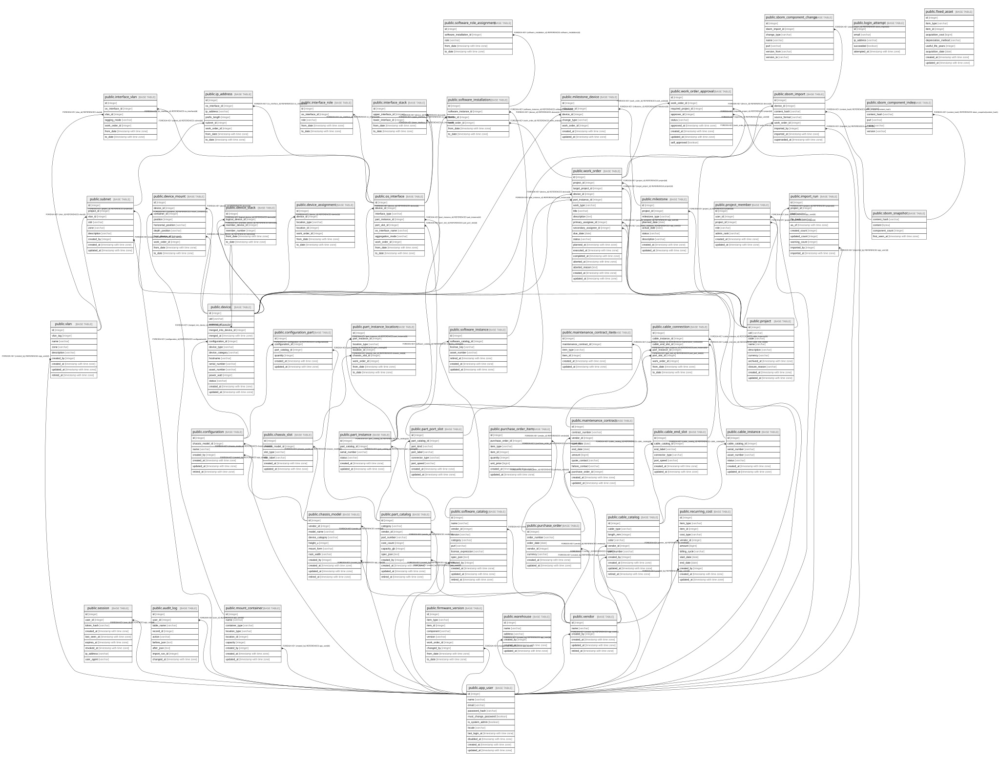

# postgres

## Tables

| Name | Columns | Comment | Type |
| ---- | ------- | ------- | ---- |
| [public.app_user](public.app_user.md) | 11 | 利用者。設計書の `USER`。`user` はPostgreSQLの予約語のため物理名を変えている（24.2.4）。 物理削除はせず `disabled_at` で無効化する（20.11）。AUDIT_LOG等から参照されるため。  | BASE TABLE |
| [public.project](public.project.md) | 10 | プロジェクト。**サービスの開始日・終了日と進行状態を持たない**（5.1）。 それらは MILESTONE から導出する。ここに日付を持つと「予定と実績の差」が失われる。  | BASE TABLE |
| [public.project_member](public.project_member.md) | 7 | 利用者とプロジェクトの対応。粒度は `(user_id, project_id, role)`。 **同一利用者が同一プロジェクトで複数ロールを兼務できる**（5章）。  | BASE TABLE |
| [public.session](public.session.md) | 9 | セッション。生のトークンは保存せずハッシュのみを持つ（20.5）。 | BASE TABLE |
| [public.login_attempt](public.login_attempt.md) | 5 | ログイン試行。レート制限に使う。**存在しない利用者への試行も記録する**ため app_user への外部キーを持たない（20.4）。  | BASE TABLE |
| [public.audit_log](public.audit_log.md) | 9 | 監査ログ。全ての書き込みがリポジトリ層を通り、同一トランザクション内で記録される（15.2、24.4）。 **認証情報の平文を含めない**（不変条件8）。  | BASE TABLE |
| [public.vendor](public.vendor.md) | 5 | ベンダーのマスタ。**名称の表記ゆれを防ぐために存在する**（18.3）。 | BASE TABLE |
| [public.chassis_model](public.chassis_model.md) | 10 | 筐体モデル。自然キーは `(vendor_id, model_name)`。**別ベンダーなら同じ型番を持てる**（6.2）。 | BASE TABLE |
| [public.chassis_slot](public.chassis_slot.md) | 6 | 筐体モデルが持つスロット。**無条件の一覧である。**「4CPU構成でなければ使えない」といった 条件付き制約は表現しない（6.1で対応しないと決着済み）。  | BASE TABLE |
| [public.part_catalog](public.part_catalog.md) | 10 | 部品カタログ。**集計に使う値だけをカラム化する**ハイブリッド方針（6.4）。  | BASE TABLE |
| [public.part_port_slot](public.part_port_slot.md) | 8 | 部品が備えるポート（8.3、8.7）。 | BASE TABLE |
| [public.configuration](public.configuration.md) | 6 | 筐体モデルに対する構成（6.2）。 | BASE TABLE |
| [public.configuration_part](public.configuration_part.md) | 6 | 構成に含まれる部品。同じ部品を複数行に分けず `quantity` で表す。 | BASE TABLE |
| [public.cable_catalog](public.cable_catalog.md) | 9 | ケーブルのカタログ（8.3）。**v1では画面・取込の対象外**だが定義は持つ。 | BASE TABLE |
| [public.cable_end_slot](public.cable_end_slot.md) | 7 | ケーブルの端。**端ごとに異なるコネクタを持てる**（8.7）。 NEMA 5-15P と C13、LC と SC のような非対称なケーブルを表すため両端を別レコードにしている。  | BASE TABLE |
| [public.software_catalog](public.software_catalog.md) | 11 | ソフトウェアのカタログ。**SBOM取込はこのテーブルを自動生成しない**（9.2）。 人が資産として登録したものだけを置く。  | BASE TABLE |
| [public.device](public.device.md) | 15 | 機器。**`in_stock` / `disposed` は `status` に持たない**（旧B-1）。 所在は DEVICE_ASSIGNMENT から導出する。状態を二重に持つと必ずずれる。  | BASE TABLE |
| [public.device_assignment](public.device_assignment.md) | 7 | 機器の所在 — **履歴テーブル。**`to_date IS NULL` が現在有効な行であり、 既存行を更新せず「閉じて開く」（不変条件1）。  | BASE TABLE |
| [public.part_instance](public.part_instance.md) | 6 | 部品の実物（6.2）。 | BASE TABLE |
| [public.part_instance_location](public.part_instance_location.md) | 8 | 部品の所在 — 履歴テーブル（6.2、12.4）。 | BASE TABLE |
| [public.firmware_version](public.firmware_version.md) | 9 | ファームウェアの版 — 履歴テーブル（6.2）。 | BASE TABLE |
| [public.device_stack](public.device_stack.md) | 6 | スタック構成 — 履歴テーブル（8.6）。スタック全体を `device_type="Logical"` の DEVICE として 登録し、物理筐体は `Physical` として別に登録する。hostname や OS_INTERFACE は論理側、 DEVICE_MOUNT や power_watt は物理側が持つ。  | BASE TABLE |
| [public.warehouse](public.warehouse.md) | 6 | 倉庫。プロジェクトを横断する未割当機器の置き場（12章）。 | BASE TABLE |
| [public.mount_container](public.mount_container.md) | 9 | 機器を載せる什器（12章）。 | BASE TABLE |
| [public.device_mount](public.device_mount.md) | 10 | 機器の搭載位置 — 履歴テーブル（12.2、13.2）。 **1行で `container_id` と `host_device_id` のどちらか一方だけが埋まる。** この排他はDB制約にせず、アプリケーション層で検証する。  | BASE TABLE |
| [public.import_run](public.import_run.md) | 10 | 取込の実行記録（23.7）。**「この不正なデータはどの取込で入ったか」を辿る**ためにある。 取込では行ごとの監査ログを書かないため（24.4）、追跡はこのテーブルが担う。  | BASE TABLE |
| [public.vlan](public.vlan.md) | 8 | VLAN（8.3）。**一意制約を張っていない。**VLANタグはL2ドメインごとに独立しており、 拠点が違えば同じタグを使える。  | BASE TABLE |
| [public.subnet](public.subnet.md) | 9 | サブネット（14.1）。**プロジェクト単位に分ける**ことで、異なるプロジェクトが 同じプライベートアドレス帯を独立に使っていても衝突しない（14.2）。  | BASE TABLE |
| [public.os_interface](public.os_interface.md) | 10 | OSから見えるインターフェース — 履歴テーブル（8.3、8.5）。 **物理ポートではなくこちらを中心に置く。**ボンド・VLANサブインターフェース・SVI・ VMの仮想NICは物理ポートに1対1で対応しない。  | BASE TABLE |
| [public.interface_stack](public.interface_stack.md) | 5 | インターフェースの積み重ね — 履歴テーブル（8.5）。 **ボンド（1 upper : N lower）とVLANサブインターフェース（1 lower : N upper）の双方を 扱うため中間テーブルにしている。**向きが逆なので片方向の外部キーでは表せない。  | BASE TABLE |
| [public.interface_vlan](public.interface_vlan.md) | 7 | インターフェースに載るVLAN — 履歴テーブル（8.3、8.6）。 | BASE TABLE |
| [public.interface_role](public.interface_role.md) | 5 | インターフェースの役割 — 履歴テーブル（8.5）。バックアップ用・vMotion用など目的別の区別で、 セキュリティ境界を表す `zone` とは**別軸**である。  | BASE TABLE |
| [public.ip_address](public.ip_address.md) | 8 | IPアドレス — 履歴テーブル（8.3、8.6、14章）。**`vlan_id` を持たない**（インターフェース 側から辿る。8.6で廃止）。同一サブネット内の重複は部分インデックスで禁じている（14.2）。  | BASE TABLE |
| [public.cable_instance](public.cable_instance.md) | 7 | ケーブルの実物（8.3）。**機器と違い所在の履歴を持たない**ため、 in_stock / disposed も status に含む。v1では画面・取込の対象外。  | BASE TABLE |
| [public.cable_connection](public.cable_connection.md) | 8 | ケーブルの接続 — 履歴テーブル（8.3）。**`device_id` を持たない** （PART_INSTANCE_LOCATION 経由で導出する。持つと部品の移設時に二重管理になる）。  | BASE TABLE |
| [public.purchase_order](public.purchase_order.md) | 7 | 発注（10章）。**`amount` を持たない**——明細の合計から計算する（旧B-5）。 持つと明細と合計がずれ、どちらが正か分からなくなる。  | BASE TABLE |
| [public.purchase_order_item](public.purchase_order_item.md) | 8 | 発注明細（10章）。 | BASE TABLE |
| [public.fixed_asset](public.fixed_asset.md) | 9 | 固定資産（10章）。**`disposal_date` と簿価を持たない**——廃棄は DEVICE_ASSIGNMENT の Disposed 行から、簿価は取得価額と経過期間から計算する （旧B-1）。持つと二重管理になり必ずずれる。  | BASE TABLE |
| [public.maintenance_contract](public.maintenance_contract.md) | 11 | 保守契約（10章）。 | BASE TABLE |
| [public.maintenance_contract_item](public.maintenance_contract_item.md) | 6 | 保守契約の対象（10章）。多態的参照のため外部キーを持てない。 | BASE TABLE |
| [public.recurring_cost](public.recurring_cost.md) | 12 | 定期費用（10章）。ラック料金・回線費用など。 | BASE TABLE |
| [public.milestone](public.milestone.md) | 9 | マイルストーン（10.4）。**予定と実績を別の列で持つ。**片方に上書きすると 「当初いつの予定だったか」が失われ、QCDの「D」を定量的に見られなくなる（5.1）。  | BASE TABLE |
| [public.milestone_device](public.milestone_device.md) | 7 | マイルストーンと機器の対応（10.4）。 | BASE TABLE |
| [public.work_order](public.work_order.md) | 19 | 変更管理チケット（11章）。**`work_order_id` を持つ履歴テーブルからの外部キーは存在しない**（24.3）。 SQLiteが後から制約を足せないため。参照整合はアプリケーション層と `dioryga check` で担保する。  | BASE TABLE |
| [public.work_order_approval](public.work_order_approval.md) | 9 | 変更の承認（11章）。**影響を受けるプロジェクトごとに1行を起こす。** 他プロジェクトの機器を巻き込む変更（移設・移譲）では複数必要になる。  | BASE TABLE |
| [public.software_instance](public.software_instance.md) | 7 | ソフトウェアの固有のインストール単位（9.3）。**バージョンアップを跨いで引き継がれる固有情報**を持つ。 **`status` を持たない**（9.4.1）。インストール状態は SOFTWARE_INSTALLATION から導出する。  | BASE TABLE |
| [public.software_installation](public.software_installation.md) | 6 | ソフトウェアのインストール — **履歴テーブル**（9.4）。`to_date IS NULL` が現在有効な行。 **1つのインスタンスが同時に2台へ入ることはない**ため現行行に部分ユニークを張る。  | BASE TABLE |
| [public.software_role_assignment](public.software_role_assignment.md) | 5 | ソフトウェアの役割 — 履歴テーブル（9.9）。**SBOM取込の対象外で、常に運用者が画面上で設定する。** 1つのインストールに複数のroleを付与できる（dnsmasqのようにDNSとDHCPを兼ねる場合）。  | BASE TABLE |
| [public.sbom_snapshot](public.sbom_snapshot.md) | 4 | SBOMのスナップショット（9.7）。**本システムで唯一、代理キーを持たないテーブル。** 主キーは正規化後の内容のSHA-256で、**同一内容は1件しか保存しない。** ゴールデンイメージが同じ機器が何台あっても実体は1つであり、保存量が台数に比例しない。  | BASE TABLE |
| [public.sbom_import](public.sbom_import.md) | 8 | SBOMの取込記録（9.5）。**`superseded_at` は他の履歴テーブルの `to_date` と同じ役割**を果たす。 **取込は SOFTWARE_INSTANCE も VENDOR も自動生成しない**（9.6。資産管理の判断は人が行う）。  | BASE TABLE |
| [public.sbom_component_change](public.sbom_component_change.md) | 7 | 直前の取込との差分（9.5）。**SBOM取込の目的はこれを記録すること**であり、 コンポーネント1件ごとの集計は要件ではない（9.2）。構成に変化がなければ0件。  | BASE TABLE |
| [public.sbom_component_index](public.sbom_component_index.md) | 5 | 機器横断のコンポーネント検索用の索引（9.8）。**再構築可能な派生索引であり、真実の源は SBOM_SNAPSHOT。** **`content_hash` 単位に張る（Device単位にしない）。**Device単位だと3,000万行になる。  | BASE TABLE |

## Relations

---

> Generated by [tbls](https://github.com/k1LoW/tbls)
