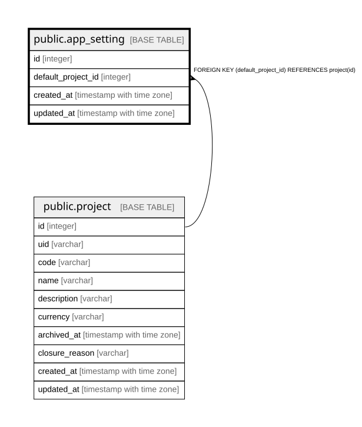

# public.app_setting

## Description

アプリ全体の設定（#217、16.1）。**id = 1 の1行だけを使う。**行が無いのは初回セットアップ前のDB。  
最初の System Admin を作るときに、倉庫用のプロジェクトとあわせて作る。  

## Columns

| Name | Type | Default | Nullable | Children | Parents | Comment |
| ---- | ---- | ------- | -------- | -------- | ------- | ------- |
| id | integer |  | false |  |  |  |
| default_project_id | integer |  | false |  | [public.project](public.project.md) | 新しい利用者を加える先（#218）。最初は倉庫用のプロジェクト。**倉庫プロジェクトの印ではない**——プロジェクト側に区別を持たない（#196）。この先はアーカイブできない |
| created_at | timestamp with time zone |  | false |  |  |  |
| updated_at | timestamp with time zone |  | false |  |  |  |

## Constraints

| Name | Type | Definition |
| ---- | ---- | ---------- |
| app_setting_created_at_not_null | n | NOT NULL created_at |
| app_setting_default_project_id_not_null | n | NOT NULL default_project_id |
| app_setting_id_not_null | n | NOT NULL id |
| app_setting_updated_at_not_null | n | NOT NULL updated_at |
| app_setting_default_project_id_fkey | FOREIGN KEY | FOREIGN KEY (default_project_id) REFERENCES project(id) |
| app_setting_pkey | PRIMARY KEY | PRIMARY KEY (id) |

## Indexes

| Name | Definition |
| ---- | ---------- |
| app_setting_pkey | CREATE UNIQUE INDEX app_setting_pkey ON public.app_setting USING btree (id) |
| idx_app_setting_default_project_id | CREATE INDEX idx_app_setting_default_project_id ON public.app_setting USING btree (default_project_id) |

## Relations

---

> Generated by [tbls](https://github.com/k1LoW/tbls)
