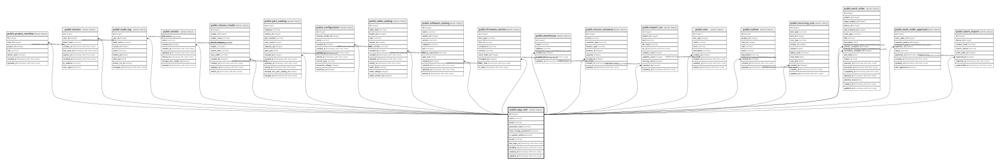

# public.app_user

## Description

利用者。設計書の `USER`。`user` はPostgreSQLの予約語のため物理名を変えている（24.2.4）。  
物理削除はせず `disabled_at` で無効化する（20.11）。AUDIT_LOG等から参照されるため。  

## Columns

| Name | Type | Default | Nullable | Children | Parents | Comment |
| ---- | ---- | ------- | -------- | -------- | ------- | ------- |
| id | integer |  | false | [public.project_member](public.project_member.md) [public.session](public.session.md) [public.audit_log](public.audit_log.md) [public.vendor](public.vendor.md) [public.chassis_model](public.chassis_model.md) [public.part_catalog](public.part_catalog.md) [public.configuration](public.configuration.md) [public.cable_catalog](public.cable_catalog.md) [public.software_catalog](public.software_catalog.md) [public.firmware_version](public.firmware_version.md) [public.warehouse](public.warehouse.md) [public.mount_container](public.mount_container.md) [public.import_run](public.import_run.md) [public.vlan](public.vlan.md) [public.subnet](public.subnet.md) [public.recurring_cost](public.recurring_cost.md) [public.work_order](public.work_order.md) [public.work_order_approval](public.work_order_approval.md) [public.sbom_import](public.sbom_import.md) |  |  |
| name | varchar |  | false |  |  |  |
| username | varchar |  | false |  |  |  |
| email | varchar |  | true |  |  |  |
| password_hash | varchar |  | false |  |  |  |
| must_change_password | boolean | false | false |  |  | 一時パスワード発行時に真。変更を終えるまで他の画面へ進めない（20.6） |
| is_system_admin | boolean | false | false |  |  | プロジェクトロールとは別軸。**真の利用者はプロジェクトデータに一切アクセスできない**（3章） |
| locale | varchar | 'ja'::character varying | false |  |  |  |
| last_login_at | timestamp with time zone |  | true |  |  |  |
| disabled_at | timestamp with time zone |  | true |  |  | null = 有効。**物理削除の代わり。** |
| created_at | timestamp with time zone |  | false |  |  |  |
| updated_at | timestamp with time zone |  | false |  |  |  |
| theme | varchar | 'system'::character varying | false |  |  | 表示モード。`system`（OSに従う）／`light`／`dark`。既定は `system`（#120） |

## Constraints

| Name | Type | Definition |
| ---- | ---- | ---------- |
| app_user_created_at_not_null | n | NOT NULL created_at |
| app_user_id_not_null | n | NOT NULL id |
| app_user_is_system_admin_not_null | n | NOT NULL is_system_admin |
| app_user_locale_not_null | n | NOT NULL locale |
| app_user_must_change_password_not_null | n | NOT NULL must_change_password |
| app_user_name_not_null | n | NOT NULL name |
| app_user_password_hash_not_null | n | NOT NULL password_hash |
| app_user_theme_not_null | n | NOT NULL theme |
| app_user_updated_at_not_null | n | NOT NULL updated_at |
| app_user_username_not_null | n | NOT NULL username |
| app_user_pkey | PRIMARY KEY | PRIMARY KEY (id) |
| app_user_username_key | UNIQUE | UNIQUE (username) |
| app_user_email_key | UNIQUE | UNIQUE (email) |

## Indexes

| Name | Definition |
| ---- | ---------- |
| app_user_pkey | CREATE UNIQUE INDEX app_user_pkey ON public.app_user USING btree (id) |
| app_user_username_key | CREATE UNIQUE INDEX app_user_username_key ON public.app_user USING btree (username) |
| app_user_email_key | CREATE UNIQUE INDEX app_user_email_key ON public.app_user USING btree (email) |

## Relations

---

> Generated by [tbls](https://github.com/k1LoW/tbls)
