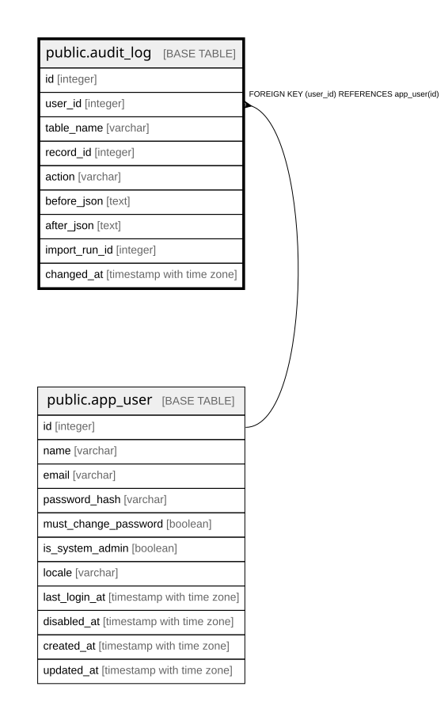

# public.audit_log

## Description

監査ログ。全ての書き込みがリポジトリ層を通り、同一トランザクション内で記録される（15.2、24.4）。  
**認証情報の平文を含めない**（不変条件8）。  

## Columns

| Name | Type | Default | Nullable | Children | Parents | Comment |
| ---- | ---- | ------- | -------- | -------- | ------- | ------- |
| id | integer |  | false |  |  |  |
| user_id | integer |  | false |  | [public.app_user](public.app_user.md) |  |
| table_name | varchar |  | false |  |  |  |
| record_id | integer |  | false |  |  |  |
| action | varchar |  | false |  |  |  |
| before_json | text |  | true |  |  |  |
| after_json | text |  | true |  |  |  |
| import_run_id | integer |  | true |  |  | 一括取込による変更。取込では行ごとの監査ログを書かず、これで追跡する（24.4） |
| changed_at | timestamp with time zone |  | false |  |  |  |

## Constraints

| Name | Type | Definition |
| ---- | ---- | ---------- |
| audit_log_action_not_null | n | NOT NULL action |
| audit_log_changed_at_not_null | n | NOT NULL changed_at |
| audit_log_id_not_null | n | NOT NULL id |
| audit_log_record_id_not_null | n | NOT NULL record_id |
| audit_log_table_name_not_null | n | NOT NULL table_name |
| audit_log_user_id_not_null | n | NOT NULL user_id |
| audit_log_user_id_fkey | FOREIGN KEY | FOREIGN KEY (user_id) REFERENCES app_user(id) |
| audit_log_pkey | PRIMARY KEY | PRIMARY KEY (id) |

## Indexes

| Name | Definition |
| ---- | ---------- |
| audit_log_pkey | CREATE UNIQUE INDEX audit_log_pkey ON public.audit_log USING btree (id) |
| idx_audit_log_table_record | CREATE INDEX idx_audit_log_table_record ON public.audit_log USING btree (table_name, record_id) |
| idx_audit_log_changed_at | CREATE INDEX idx_audit_log_changed_at ON public.audit_log USING btree (changed_at) |

## Relations

---

> Generated by [tbls](https://github.com/k1LoW/tbls)
