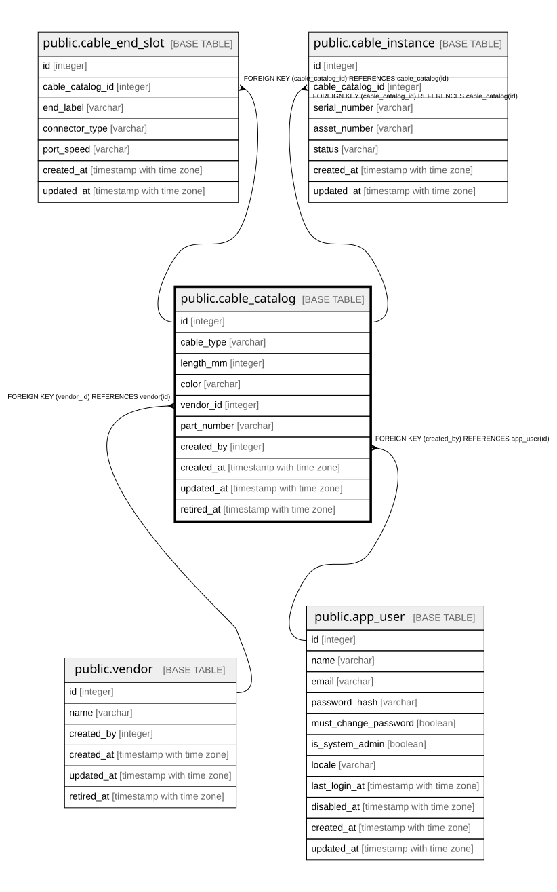

# public.cable_catalog

## Description

ケーブルのカタログ（8.3）。**v1では画面・取込の対象外**だが定義は持つ。

## Columns

| Name | Type | Default | Nullable | Children | Parents | Comment |
| ---- | ---- | ------- | -------- | -------- | ------- | ------- |
| id | integer |  | false | [public.cable_end_slot](public.cable_end_slot.md) [public.cable_instance](public.cable_instance.md) |  |  |
| cable_type | varchar |  | false |  |  |  |
| length_mm | integer |  | true |  |  | **ミリメートルの整数。**SQLiteに DECIMAL が無いため（24.2.1）。 単位を列名に含めているのは1000倍の取り違えを防ぐため  |
| color | varchar | ''::character varying | false |  |  |  |
| vendor_id | integer |  | true |  | [public.vendor](public.vendor.md) |  |
| part_number | varchar |  | true |  |  |  |
| created_by | integer |  | false |  | [public.app_user](public.app_user.md) |  |
| created_at | timestamp with time zone |  | false |  |  |  |
| updated_at | timestamp with time zone |  | false |  |  |  |
| retired_at | timestamp with time zone |  | true |  |  |  |
| cable_kind | varchar |  | true |  |  | Network / Power / Stack（8.7）。**ネットワークと電源はテーブルではなく ここと画面で分ける。**接続グラフは流れているものによらず同じ形のため。 **DB上はnullableだがアプリケーション層では必須**——SQLiteが後から NOT NULL を足す際に要求するDEFAULTが残り、種別未指定を黙って Network に分類してしまうため（8.6、24.3）  |
| rated_voltage | integer |  | true |  |  | `cable_kind=Power` のときだけ意味を持つ（8.7） |
| rated_current_ma | integer |  | true |  |  | 同上。**mAの整数**（24.2.1）。**形状が嵌合しても定格が足りなければ 使えない**——同じC13に10A品と15A品がある  |

## Constraints

| Name | Type | Definition |
| ---- | ---- | ---------- |
| cable_catalog_cable_type_not_null | n | NOT NULL cable_type |
| cable_catalog_color_not_null | n | NOT NULL color |
| cable_catalog_created_at_not_null | n | NOT NULL created_at |
| cable_catalog_created_by_not_null | n | NOT NULL created_by |
| cable_catalog_id_not_null | n | NOT NULL id |
| cable_catalog_updated_at_not_null | n | NOT NULL updated_at |
| cable_catalog_created_by_fkey | FOREIGN KEY | FOREIGN KEY (created_by) REFERENCES app_user(id) |
| cable_catalog_vendor_id_fkey | FOREIGN KEY | FOREIGN KEY (vendor_id) REFERENCES vendor(id) |
| cable_catalog_pkey | PRIMARY KEY | PRIMARY KEY (id) |

## Indexes

| Name | Definition |
| ---- | ---------- |
| cable_catalog_pkey | CREATE UNIQUE INDEX cable_catalog_pkey ON public.cable_catalog USING btree (id) |
| idx_cable_catalog_vendor | CREATE INDEX idx_cable_catalog_vendor ON public.cable_catalog USING btree (vendor_id) |
| idx_cable_catalog_retired_at | CREATE INDEX idx_cable_catalog_retired_at ON public.cable_catalog USING btree (retired_at) |

## Relations

---

> Generated by [tbls](https://github.com/k1LoW/tbls)
