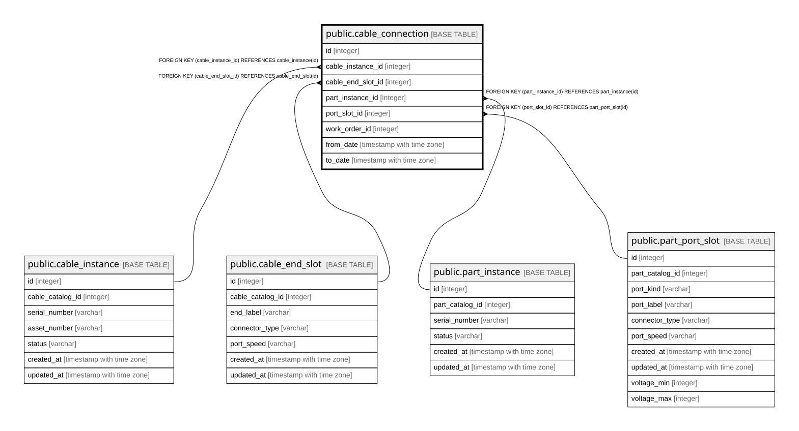

# public.cable_connection

## Description

ケーブルの接続 — 履歴テーブル（8.3）。**`device_id` を持たない**  
（PART_INSTANCE_LOCATION 経由で導出する。持つと部品の移設時に二重管理になる）。  

## Columns

| Name | Type | Default | Nullable | Children | Parents | Comment |
| ---- | ---- | ------- | -------- | -------- | ------- | ------- |
| id | integer |  | false |  |  |  |
| cable_instance_id | integer |  | false |  | [public.cable_instance](public.cable_instance.md) |  |
| cable_end_slot_id | integer |  | false |  | [public.cable_end_slot](public.cable_end_slot.md) | どちらの端か。両端が非対称なケーブルがあるため端ごとに持つ（8.7） |
| part_instance_id | integer |  | false |  | [public.part_instance](public.part_instance.md) |  |
| port_slot_id | integer |  | false |  | [public.part_port_slot](public.part_port_slot.md) |  |
| work_order_id | integer |  | true |  |  |  |
| from_date | timestamp with time zone |  | false |  |  |  |
| to_date | timestamp with time zone |  | true |  |  | null が現在有効な行 |

## Constraints

| Name | Type | Definition |
| ---- | ---- | ---------- |
| cable_connection_port_slot_id_fkey | FOREIGN KEY | FOREIGN KEY (port_slot_id) REFERENCES part_port_slot(id) |
| cable_connection_cable_end_slot_id_fkey | FOREIGN KEY | FOREIGN KEY (cable_end_slot_id) REFERENCES cable_end_slot(id) |
| cable_connection_part_instance_id_fkey | FOREIGN KEY | FOREIGN KEY (part_instance_id) REFERENCES part_instance(id) |
| cable_connection_cable_instance_id_fkey | FOREIGN KEY | FOREIGN KEY (cable_instance_id) REFERENCES cable_instance(id) |
| cable_connection_pkey | PRIMARY KEY | PRIMARY KEY (id) |

## Indexes

| Name | Definition |
| ---- | ---------- |
| cable_connection_pkey | CREATE UNIQUE INDEX cable_connection_pkey ON public.cable_connection USING btree (id) |
| idx_cable_connection_cable_current | CREATE INDEX idx_cable_connection_cable_current ON public.cable_connection USING btree (cable_instance_id) WHERE (to_date IS NULL) |
| idx_cable_connection_port_current | CREATE INDEX idx_cable_connection_port_current ON public.cable_connection USING btree (port_slot_id) WHERE (to_date IS NULL) |
| idx_cable_connection_end_slot | CREATE INDEX idx_cable_connection_end_slot ON public.cable_connection USING btree (cable_end_slot_id) |
| idx_cable_connection_part_instance | CREATE INDEX idx_cable_connection_part_instance ON public.cable_connection USING btree (part_instance_id) |

## Relations

---

> Generated by [tbls](https://github.com/k1LoW/tbls)
