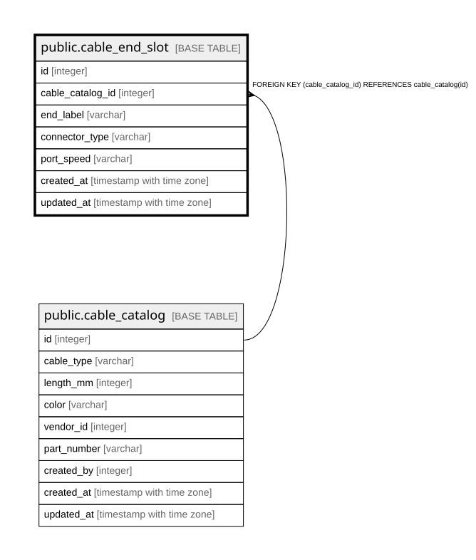

# public.cable_end_slot

## Description

ケーブルの端。**端ごとに異なるコネクタを持てる**（8.7）。  
NEMA 5-15P と C13、LC と SC のような非対称なケーブルを表すため両端を別レコードにしている。  

## Columns

| Name | Type | Default | Nullable | Children | Parents | Comment |
| ---- | ---- | ------- | -------- | -------- | ------- | ------- |
| id | integer |  | false | [public.cable_connection](public.cable_connection.md) |  |  |
| cable_catalog_id | integer |  | false |  | [public.cable_catalog](public.cable_catalog.md) |  |
| end_label | varchar |  | false |  |  |  |
| connector_type | varchar |  | false |  |  |  |
| port_speed | varchar |  | true |  |  |  |
| created_at | timestamp with time zone |  | false |  |  |  |
| updated_at | timestamp with time zone |  | false |  |  |  |

## Constraints

| Name | Type | Definition |
| ---- | ---- | ---------- |
| cable_end_slot_cable_catalog_id_not_null | n | NOT NULL cable_catalog_id |
| cable_end_slot_connector_type_not_null | n | NOT NULL connector_type |
| cable_end_slot_created_at_not_null | n | NOT NULL created_at |
| cable_end_slot_end_label_not_null | n | NOT NULL end_label |
| cable_end_slot_id_not_null | n | NOT NULL id |
| cable_end_slot_updated_at_not_null | n | NOT NULL updated_at |
| cable_end_slot_cable_catalog_id_fkey | FOREIGN KEY | FOREIGN KEY (cable_catalog_id) REFERENCES cable_catalog(id) |
| cable_end_slot_pkey | PRIMARY KEY | PRIMARY KEY (id) |

## Indexes

| Name | Definition |
| ---- | ---------- |
| cable_end_slot_pkey | CREATE UNIQUE INDEX cable_end_slot_pkey ON public.cable_end_slot USING btree (id) |
| uq_cable_end_slot_catalog_label | CREATE UNIQUE INDEX uq_cable_end_slot_catalog_label ON public.cable_end_slot USING btree (cable_catalog_id, end_label) |

## Relations

---

> Generated by [tbls](https://github.com/k1LoW/tbls)
