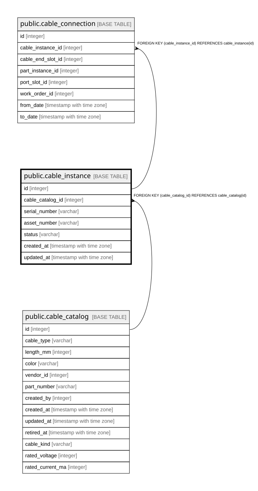

# public.cable_instance

## Description

ケーブルの実物（8.3）。**機器と違い所在の履歴を持たない**ため、  
in_stock / disposed も status に含む。v1では画面・取込の対象外。  

## Columns

| Name | Type | Default | Nullable | Children | Parents | Comment |
| ---- | ---- | ------- | -------- | -------- | ------- | ------- |
| id | integer |  | false | [public.cable_connection](public.cable_connection.md) |  |  |
| cable_catalog_id | integer |  | false |  | [public.cable_catalog](public.cable_catalog.md) |  |
| serial_number | varchar |  | true |  |  |  |
| asset_number | varchar |  | true |  |  |  |
| status | varchar |  | false |  |  |  |
| created_at | timestamp with time zone |  | false |  |  |  |
| updated_at | timestamp with time zone |  | false |  |  |  |

## Constraints

| Name | Type | Definition |
| ---- | ---- | ---------- |
| cable_instance_cable_catalog_id_not_null | n | NOT NULL cable_catalog_id |
| cable_instance_created_at_not_null | n | NOT NULL created_at |
| cable_instance_id_not_null | n | NOT NULL id |
| cable_instance_status_not_null | n | NOT NULL status |
| cable_instance_updated_at_not_null | n | NOT NULL updated_at |
| cable_instance_cable_catalog_id_fkey | FOREIGN KEY | FOREIGN KEY (cable_catalog_id) REFERENCES cable_catalog(id) |
| cable_instance_pkey | PRIMARY KEY | PRIMARY KEY (id) |

## Indexes

| Name | Definition |
| ---- | ---------- |
| cable_instance_pkey | CREATE UNIQUE INDEX cable_instance_pkey ON public.cable_instance USING btree (id) |
| idx_cable_instance_catalog | CREATE INDEX idx_cable_instance_catalog ON public.cable_instance USING btree (cable_catalog_id) |

## Relations

---

> Generated by [tbls](https://github.com/k1LoW/tbls)
