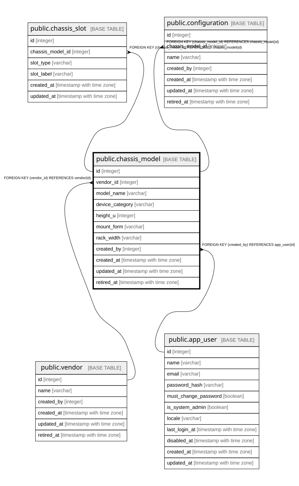

# public.chassis_model

## Description

筐体モデル。自然キーは `(vendor_id, model_name)`。**別ベンダーなら同じ型番を持てる**（6.2）。

## Columns

| Name | Type | Default | Nullable | Children | Parents | Comment |
| ---- | ---- | ------- | -------- | -------- | ------- | ------- |
| id | integer |  | false | [public.chassis_slot](public.chassis_slot.md) [public.configuration](public.configuration.md) |  |  |
| vendor_id | integer |  | false |  | [public.vendor](public.vendor.md) |  |
| model_name | varchar |  | false |  |  |  |
| device_category | varchar |  | false |  |  |  |
| height_u | integer | 0 | false |  |  | ラック搭載時の高さ。mount_form=Surface では意味を持たない |
| mount_form | varchar |  | false |  |  |  |
| rack_width | varchar |  | true |  |  | Full / Half。mount_form=RackU のときのみ意味を持つ |
| created_by | integer |  | false |  | [public.app_user](public.app_user.md) |  |
| created_at | timestamp with time zone |  | false |  |  |  |
| updated_at | timestamp with time zone |  | false |  |  |  |
| retired_at | timestamp with time zone |  | true |  |  |  |

## Constraints

| Name | Type | Definition |
| ---- | ---- | ---------- |
| chassis_model_created_at_not_null | n | NOT NULL created_at |
| chassis_model_created_by_not_null | n | NOT NULL created_by |
| chassis_model_device_category_not_null | n | NOT NULL device_category |
| chassis_model_height_u_not_null | n | NOT NULL height_u |
| chassis_model_id_not_null | n | NOT NULL id |
| chassis_model_model_name_not_null | n | NOT NULL model_name |
| chassis_model_mount_form_not_null | n | NOT NULL mount_form |
| chassis_model_updated_at_not_null | n | NOT NULL updated_at |
| chassis_model_vendor_id_not_null | n | NOT NULL vendor_id |
| chassis_model_created_by_fkey | FOREIGN KEY | FOREIGN KEY (created_by) REFERENCES app_user(id) |
| chassis_model_vendor_id_fkey | FOREIGN KEY | FOREIGN KEY (vendor_id) REFERENCES vendor(id) |
| chassis_model_pkey | PRIMARY KEY | PRIMARY KEY (id) |

## Indexes

| Name | Definition |
| ---- | ---------- |
| chassis_model_pkey | CREATE UNIQUE INDEX chassis_model_pkey ON public.chassis_model USING btree (id) |
| uq_chassis_model_vendor_model_name | CREATE UNIQUE INDEX uq_chassis_model_vendor_model_name ON public.chassis_model USING btree (vendor_id, model_name) |
| idx_chassis_model_retired_at | CREATE INDEX idx_chassis_model_retired_at ON public.chassis_model USING btree (retired_at) |

## Relations

---

> Generated by [tbls](https://github.com/k1LoW/tbls)
