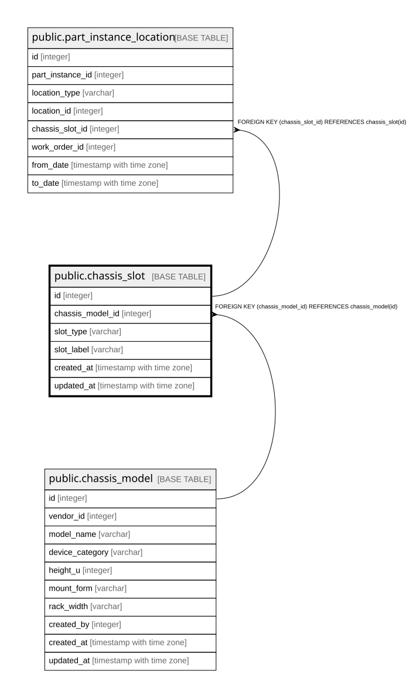

# public.chassis_slot

## Description

筐体モデルが持つスロット。**無条件の一覧である。**「4CPU構成でなければ使えない」といった  
条件付き制約は表現しない（6.1で対応しないと決着済み）。  

## Columns

| Name | Type | Default | Nullable | Children | Parents | Comment |
| ---- | ---- | ------- | -------- | -------- | ------- | ------- |
| id | integer |  | false | [public.part_instance_location](public.part_instance_location.md) |  |  |
| chassis_model_id | integer |  | false |  | [public.chassis_model](public.chassis_model.md) |  |
| slot_type | varchar |  | false |  |  |  |
| slot_label | varchar |  | false |  |  |  |
| created_at | timestamp with time zone |  | false |  |  |  |
| updated_at | timestamp with time zone |  | false |  |  |  |

## Constraints

| Name | Type | Definition |
| ---- | ---- | ---------- |
| chassis_slot_chassis_model_id_not_null | n | NOT NULL chassis_model_id |
| chassis_slot_created_at_not_null | n | NOT NULL created_at |
| chassis_slot_id_not_null | n | NOT NULL id |
| chassis_slot_slot_label_not_null | n | NOT NULL slot_label |
| chassis_slot_slot_type_not_null | n | NOT NULL slot_type |
| chassis_slot_updated_at_not_null | n | NOT NULL updated_at |
| chassis_slot_chassis_model_id_fkey | FOREIGN KEY | FOREIGN KEY (chassis_model_id) REFERENCES chassis_model(id) |
| chassis_slot_pkey | PRIMARY KEY | PRIMARY KEY (id) |

## Indexes

| Name | Definition |
| ---- | ---------- |
| chassis_slot_pkey | CREATE UNIQUE INDEX chassis_slot_pkey ON public.chassis_slot USING btree (id) |
| idx_chassis_slot_model | CREATE INDEX idx_chassis_slot_model ON public.chassis_slot USING btree (chassis_model_id) |

## Relations

---

> Generated by [tbls](https://github.com/k1LoW/tbls)
