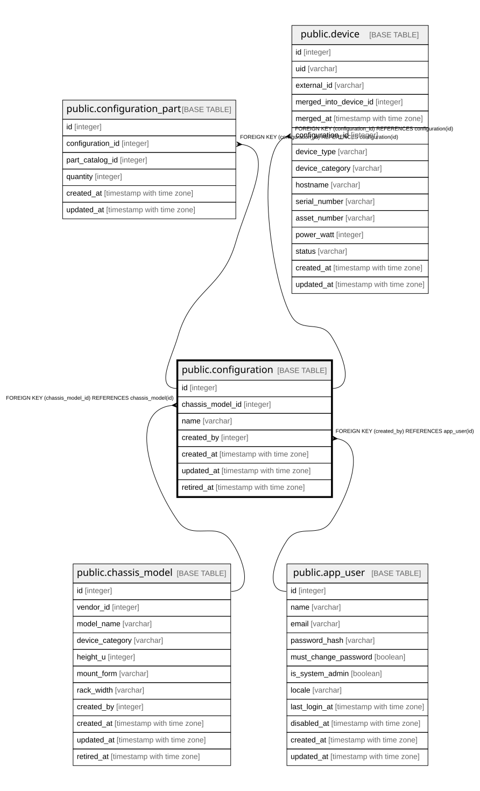

# public.configuration

## Description

筐体モデルに対する構成（6.2）。

## Columns

| Name | Type | Default | Nullable | Children | Parents | Comment |
| ---- | ---- | ------- | -------- | -------- | ------- | ------- |
| id | integer |  | false | [public.configuration_part](public.configuration_part.md) [public.device](public.device.md) |  |  |
| chassis_model_id | integer |  | false |  | [public.chassis_model](public.chassis_model.md) |  |
| name | varchar |  | false |  |  |  |
| created_by | integer |  | false |  | [public.app_user](public.app_user.md) |  |
| created_at | timestamp with time zone |  | false |  |  |  |
| updated_at | timestamp with time zone |  | false |  |  |  |
| retired_at | timestamp with time zone |  | true |  |  |  |

## Constraints

| Name | Type | Definition |
| ---- | ---- | ---------- |
| configuration_chassis_model_id_not_null | n | NOT NULL chassis_model_id |
| configuration_created_at_not_null | n | NOT NULL created_at |
| configuration_created_by_not_null | n | NOT NULL created_by |
| configuration_id_not_null | n | NOT NULL id |
| configuration_name_not_null | n | NOT NULL name |
| configuration_updated_at_not_null | n | NOT NULL updated_at |
| configuration_created_by_fkey | FOREIGN KEY | FOREIGN KEY (created_by) REFERENCES app_user(id) |
| configuration_chassis_model_id_fkey | FOREIGN KEY | FOREIGN KEY (chassis_model_id) REFERENCES chassis_model(id) |
| configuration_pkey | PRIMARY KEY | PRIMARY KEY (id) |

## Indexes

| Name | Definition |
| ---- | ---------- |
| configuration_pkey | CREATE UNIQUE INDEX configuration_pkey ON public.configuration USING btree (id) |
| idx_configuration_chassis_model | CREATE INDEX idx_configuration_chassis_model ON public.configuration USING btree (chassis_model_id) |
| idx_configuration_retired_at | CREATE INDEX idx_configuration_retired_at ON public.configuration USING btree (retired_at) |

## Relations

---

> Generated by [tbls](https://github.com/k1LoW/tbls)
