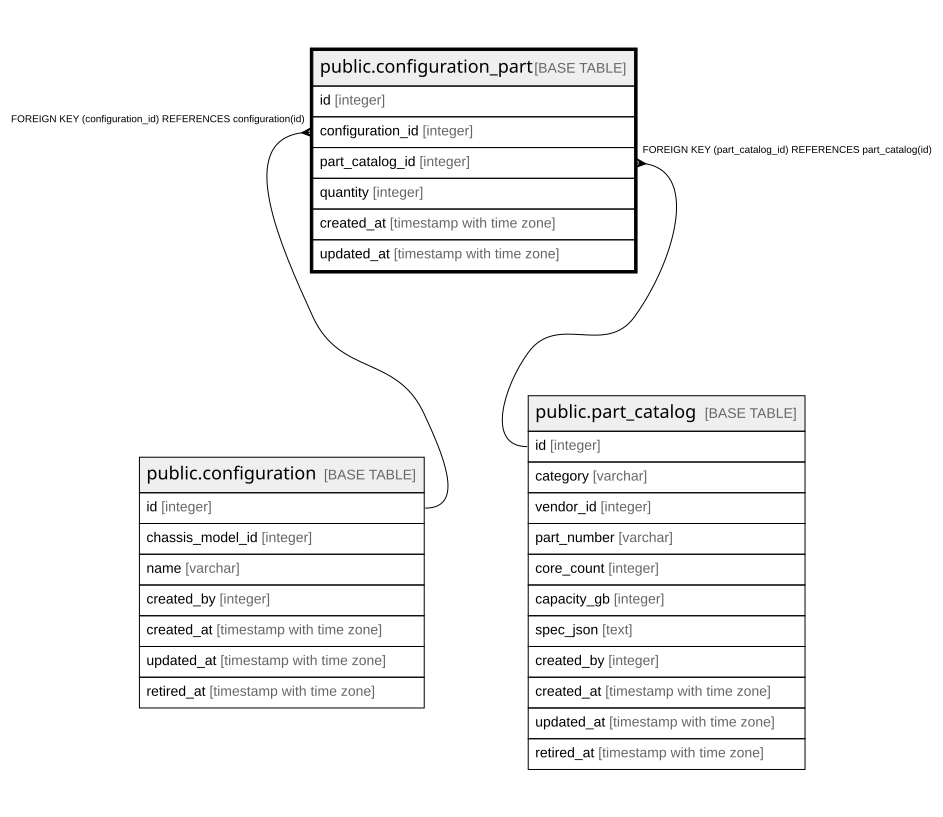

# public.configuration_part

## Description

構成に含まれる部品。同じ部品を複数行に分けず `quantity` で表す。

## Columns

| Name | Type | Default | Nullable | Children | Parents | Comment |
| ---- | ---- | ------- | -------- | -------- | ------- | ------- |
| id | integer |  | false |  |  |  |
| configuration_id | integer |  | false |  | [public.configuration](public.configuration.md) |  |
| part_catalog_id | integer |  | false |  | [public.part_catalog](public.part_catalog.md) |  |
| quantity | integer | 1 | false |  |  |  |
| created_at | timestamp with time zone |  | false |  |  |  |
| updated_at | timestamp with time zone |  | false |  |  |  |

## Constraints

| Name | Type | Definition |
| ---- | ---- | ---------- |
| configuration_part_part_catalog_id_fkey | FOREIGN KEY | FOREIGN KEY (part_catalog_id) REFERENCES part_catalog(id) |
| configuration_part_configuration_id_fkey | FOREIGN KEY | FOREIGN KEY (configuration_id) REFERENCES configuration(id) |
| configuration_part_pkey | PRIMARY KEY | PRIMARY KEY (id) |

## Indexes

| Name | Definition |
| ---- | ---------- |
| configuration_part_pkey | CREATE UNIQUE INDEX configuration_part_pkey ON public.configuration_part USING btree (id) |
| uq_configuration_part | CREATE UNIQUE INDEX uq_configuration_part ON public.configuration_part USING btree (configuration_id, part_catalog_id) |

## Relations

---

> Generated by [tbls](https://github.com/k1LoW/tbls)
