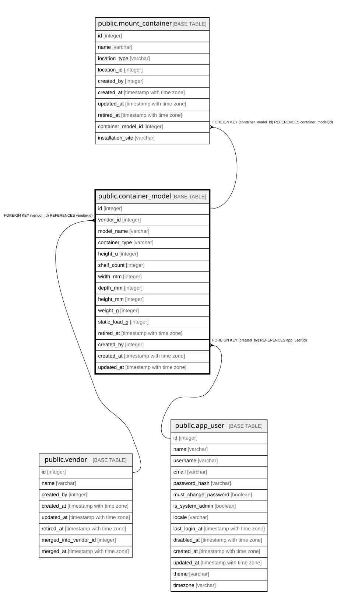

# public.container_model

## Description

設備・什器の型番（12.10、#205）。自然キーは `(vendor_id, model_name)`。種別で収容能力の列が分かれる

## Columns

| Name | Type | Default | Nullable | Children | Parents | Comment |
| ---- | ---- | ------- | -------- | -------- | ------- | ------- |
| id | integer |  | false | [public.mount_container](public.mount_container.md) |  |  |
| vendor_id | integer |  | false |  | [public.vendor](public.vendor.md) |  |
| model_name | varchar |  | false |  |  |  |
| container_type | varchar |  | false |  |  | Rack / Desk / Shelving（閉じた語彙） |
| height_u | integer |  | true |  |  | Rack のみ。総U数。**制約ではなく目安**で、超過は警告（不変条件6） |
| shelf_count | integer |  | true |  |  | Shelving のみ。段数 |
| width_mm | integer |  | true |  |  |  |
| depth_mm | integer |  | true |  |  |  |
| height_mm | integer |  | true |  |  |  |
| weight_g | integer |  | true |  |  | 本体の重量（g） |
| static_load_g | integer |  | true |  |  | 静荷重（耐荷重、g）。移動時の動荷重は持たない |
| retired_at | timestamp with time zone |  | true |  |  |  |
| created_by | integer |  | false |  | [public.app_user](public.app_user.md) |  |
| created_at | timestamp with time zone |  | false |  |  |  |
| updated_at | timestamp with time zone |  | false |  |  |  |

## Constraints

| Name | Type | Definition |
| ---- | ---- | ---------- |
| container_model_container_type_not_null | n | NOT NULL container_type |
| container_model_created_at_not_null | n | NOT NULL created_at |
| container_model_created_by_not_null | n | NOT NULL created_by |
| container_model_id_not_null | n | NOT NULL id |
| container_model_model_name_not_null | n | NOT NULL model_name |
| container_model_updated_at_not_null | n | NOT NULL updated_at |
| container_model_vendor_id_not_null | n | NOT NULL vendor_id |
| container_model_created_by_fkey | FOREIGN KEY | FOREIGN KEY (created_by) REFERENCES app_user(id) |
| container_model_vendor_id_fkey | FOREIGN KEY | FOREIGN KEY (vendor_id) REFERENCES vendor(id) |
| container_model_pkey | PRIMARY KEY | PRIMARY KEY (id) |

## Indexes

| Name | Definition |
| ---- | ---------- |
| container_model_pkey | CREATE UNIQUE INDEX container_model_pkey ON public.container_model USING btree (id) |
| uq_container_model_vendor_model_name | CREATE UNIQUE INDEX uq_container_model_vendor_model_name ON public.container_model USING btree (vendor_id, model_name) |

## Relations

---

> Generated by [tbls](https://github.com/k1LoW/tbls)
