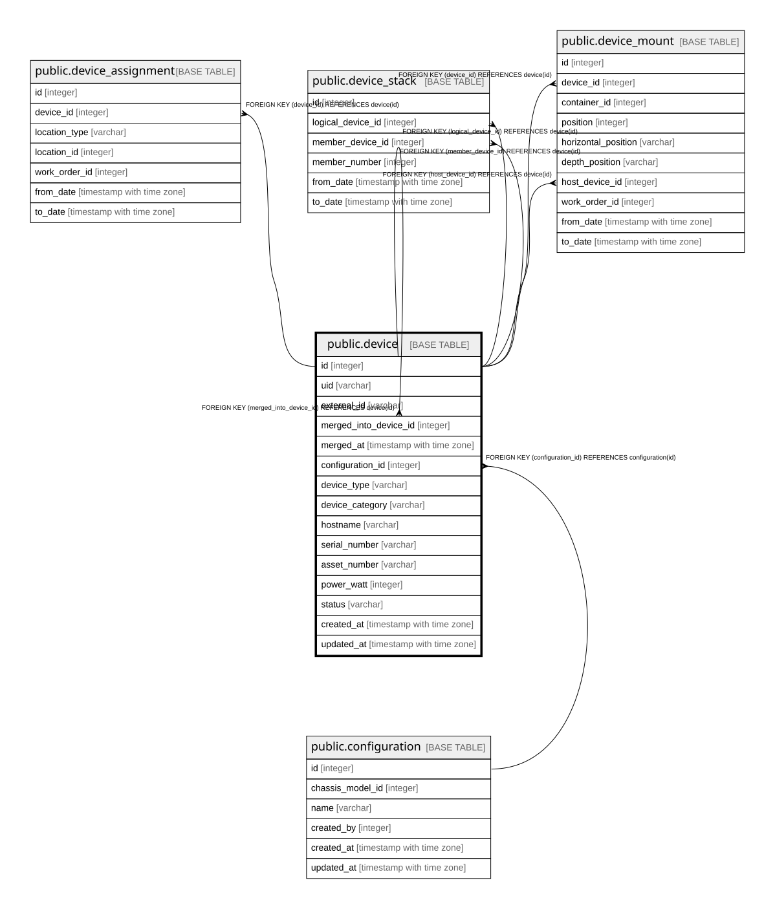

# public.device

## Description

機器。**`in_stock` / `disposed` は `status` に持たない**（旧B-1）。  
所在は DEVICE_ASSIGNMENT から導出する。状態を二重に持つと必ずずれる。  

## Columns

| Name | Type | Default | Nullable | Children | Parents | Comment |
| ---- | ---- | ------- | -------- | -------- | ------- | ------- |
| id | integer |  | false | [public.device](public.device.md) [public.device_assignment](public.device_assignment.md) [public.device_stack](public.device_stack.md) [public.device_mount](public.device_mount.md) [public.os_interface](public.os_interface.md) [public.milestone_device](public.milestone_device.md) [public.work_order](public.work_order.md) |  |  |
| uid | varchar |  | false |  |  | 登録時に採番する不変の識別子。取込時の突合に使う（23.2） |
| external_id | varchar |  | true |  |  | 取込元システムでの識別子。再取込時の突合用 |
| merged_into_device_id | integer |  | true |  | [public.device](public.device.md) | 重複統合で吸収された場合の統合先。**削除ではなくリダイレクト**（23.9）  |
| merged_at | timestamp with time zone |  | true |  |  |  |
| configuration_id | integer |  | true |  | [public.configuration](public.configuration.md) |  |
| device_type | varchar |  | false |  |  | Physical / Virtual / Container / **Logical**。Logical は複数の筐体が1台として振る舞うもの |
| device_category | varchar |  | true |  |  | `configuration_id` が無い機器（仮想アプライアンス等）の分類 |
| hostname | varchar |  | false |  |  |  |
| serial_number | varchar |  | true |  |  | Virtual / Container には存在しない（6.2） |
| asset_number | varchar |  | true |  |  | **nullable。**組織によっては申請から採番まで時間がかかり、 番号が届くまで登録できないのは実務上成立しない（23.2）  |
| power_watt | integer | 0 | false |  |  |  |
| status | varchar |  | false |  |  | running / broken / repair / plan / building。**所在は含まない** |
| created_at | timestamp with time zone |  | false |  |  |  |
| updated_at | timestamp with time zone |  | false |  |  |  |

## Constraints

| Name | Type | Definition |
| ---- | ---- | ---------- |
| device_configuration_id_fkey | FOREIGN KEY | FOREIGN KEY (configuration_id) REFERENCES configuration(id) |
| device_merged_into_device_id_fkey | FOREIGN KEY | FOREIGN KEY (merged_into_device_id) REFERENCES device(id) |
| device_pkey | PRIMARY KEY | PRIMARY KEY (id) |
| device_uid_key | UNIQUE | UNIQUE (uid) |

## Indexes

| Name | Definition |
| ---- | ---------- |
| device_pkey | CREATE UNIQUE INDEX device_pkey ON public.device USING btree (id) |
| device_uid_key | CREATE UNIQUE INDEX device_uid_key ON public.device USING btree (uid) |
| idx_device_serial_number | CREATE INDEX idx_device_serial_number ON public.device USING btree (serial_number) |
| idx_device_hostname | CREATE INDEX idx_device_hostname ON public.device USING btree (hostname) |
| idx_device_external_id | CREATE INDEX idx_device_external_id ON public.device USING btree (external_id) |
| idx_device_merged_into | CREATE INDEX idx_device_merged_into ON public.device USING btree (merged_into_device_id) |
| idx_device_configuration | CREATE INDEX idx_device_configuration ON public.device USING btree (configuration_id) |

## Relations

---

> Generated by [tbls](https://github.com/k1LoW/tbls)
