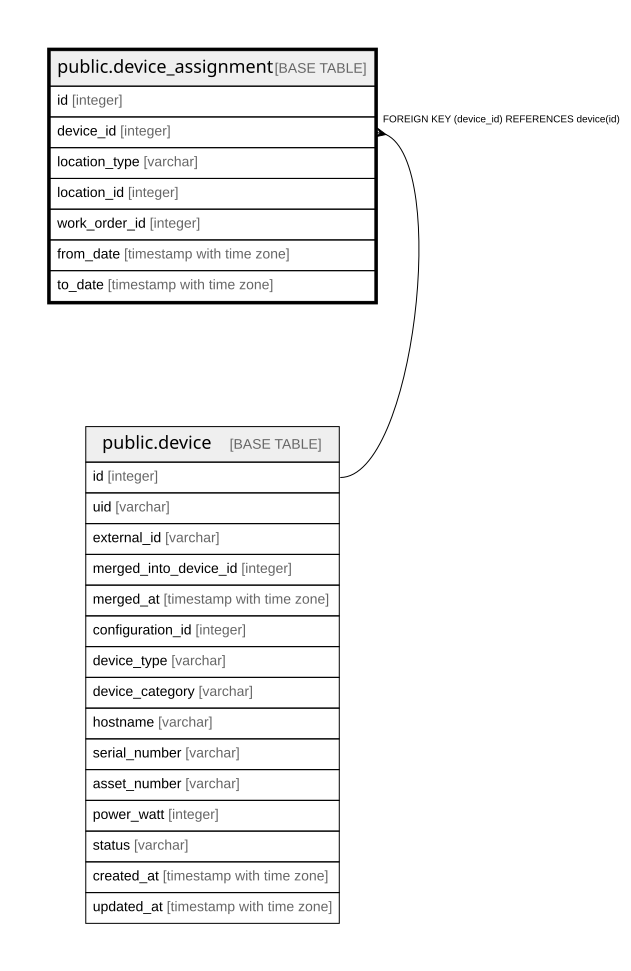

# public.device_assignment

## Description

機器の所在 — **履歴テーブル。**`to_date IS NULL` が現在有効な行であり、  
既存行を更新せず「閉じて開く」（不変条件1）。  

## Columns

| Name | Type | Default | Nullable | Children | Parents | Comment |
| ---- | ---- | ------- | -------- | -------- | ------- | ------- |
| id | integer |  | false |  |  |  |
| device_id | integer |  | false |  | [public.device](public.device.md) |  |
| location_type | varchar |  | false |  |  | Warehouse / Project / Disposed。**多態的参照のため外部キーを持てない**（旧C-7） |
| location_id | integer |  | true |  |  | Disposed のときは null |
| work_order_id | integer |  | true |  |  | この変更を引き起こしたWORK_ORDER（11章）。**WORK_ORDER未作成のため外部キーは未設定** |
| from_date | timestamp with time zone |  | false |  |  |  |
| to_date | timestamp with time zone |  | true |  |  | null が現在有効な行 |

## Constraints

| Name | Type | Definition |
| ---- | ---- | ---------- |
| device_assignment_device_id_fkey | FOREIGN KEY | FOREIGN KEY (device_id) REFERENCES device(id) |
| device_assignment_pkey | PRIMARY KEY | PRIMARY KEY (id) |

## Indexes

| Name | Definition |
| ---- | ---------- |
| device_assignment_pkey | CREATE UNIQUE INDEX device_assignment_pkey ON public.device_assignment USING btree (id) |
| idx_device_assignment_current | CREATE INDEX idx_device_assignment_current ON public.device_assignment USING btree (device_id) WHERE (to_date IS NULL) |
| idx_device_assignment_location | CREATE INDEX idx_device_assignment_location ON public.device_assignment USING btree (location_type, location_id) |

## Relations

---

> Generated by [tbls](https://github.com/k1LoW/tbls)
