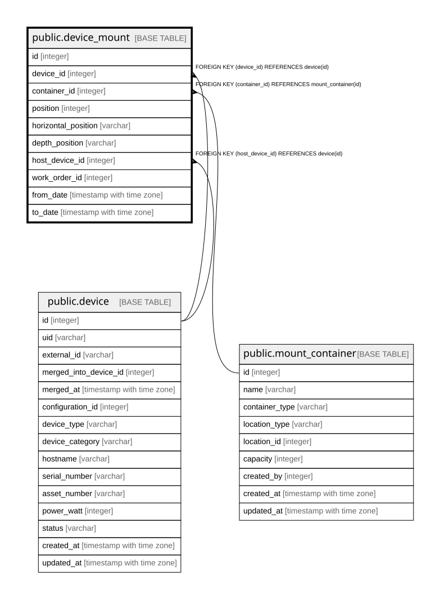

# public.device_mount

## Description

機器の搭載位置 — 履歴テーブル（12.2、13.2）。  
**1行で `container_id` と `host_device_id` のどちらか一方だけが埋まる。**  
この排他はDB制約にせず、アプリケーション層で検証する。  

## Columns

| Name | Type | Default | Nullable | Children | Parents | Comment |
| ---- | ---- | ------- | -------- | -------- | ------- | ------- |
| id | integer |  | false |  |  |  |
| device_id | integer |  | false |  | [public.device](public.device.md) |  |
| container_id | integer |  | true |  | [public.mount_container](public.mount_container.md) | 什器に直接搭載する場合。`host_device_id` とは排他 |
| position | integer |  | true |  |  | Rack なら開始U番号、Shelving なら段番号 |
| horizontal_position | varchar |  | true |  |  |  |
| depth_position | varchar |  | true |  |  |  |
| host_device_id | integer |  | true |  | [public.device](public.device.md) | 他の機器の上に載る場合（棚板、VMの実行ホスト）。`container_id` とは排他 |
| work_order_id | integer |  | true |  |  |  |
| from_date | timestamp with time zone |  | false |  |  |  |
| to_date | timestamp with time zone |  | true |  |  | null が現在有効な行 |

## Constraints

| Name | Type | Definition |
| ---- | ---- | ---------- |
| device_mount_device_id_fkey | FOREIGN KEY | FOREIGN KEY (device_id) REFERENCES device(id) |
| device_mount_host_device_id_fkey | FOREIGN KEY | FOREIGN KEY (host_device_id) REFERENCES device(id) |
| device_mount_container_id_fkey | FOREIGN KEY | FOREIGN KEY (container_id) REFERENCES mount_container(id) |
| device_mount_pkey | PRIMARY KEY | PRIMARY KEY (id) |

## Indexes

| Name | Definition |
| ---- | ---------- |
| device_mount_pkey | CREATE UNIQUE INDEX device_mount_pkey ON public.device_mount USING btree (id) |
| idx_device_mount_current | CREATE INDEX idx_device_mount_current ON public.device_mount USING btree (device_id) WHERE (to_date IS NULL) |
| idx_device_mount_container_current | CREATE INDEX idx_device_mount_container_current ON public.device_mount USING btree (container_id) WHERE (to_date IS NULL) |
| idx_device_mount_host_current | CREATE INDEX idx_device_mount_host_current ON public.device_mount USING btree (host_device_id) WHERE (to_date IS NULL) |

## Relations

---

> Generated by [tbls](https://github.com/k1LoW/tbls)
