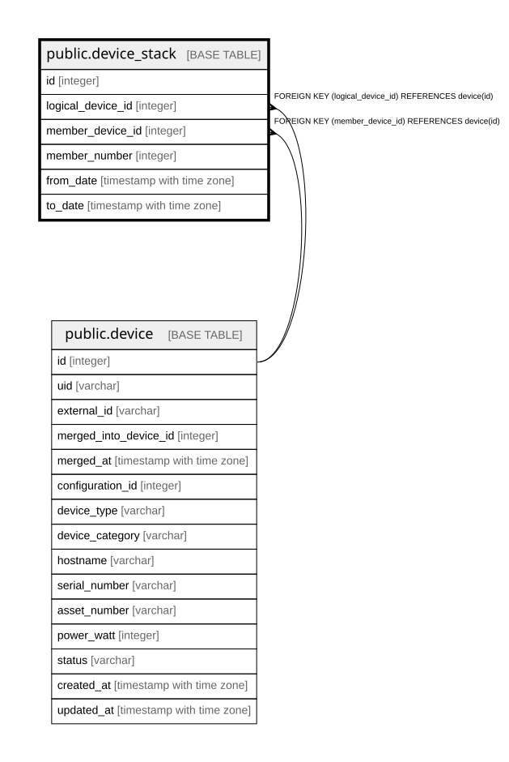

# public.device_stack

## Description

スタック構成 — 履歴テーブル（8.6）。スタック全体を `device_type="Logical"` の DEVICE として  
登録し、物理筐体は `Physical` として別に登録する。hostname や OS_INTERFACE は論理側、  
DEVICE_MOUNT や power_watt は物理側が持つ。  

## Columns

| Name | Type | Default | Nullable | Children | Parents | Comment |
| ---- | ---- | ------- | -------- | -------- | ------- | ------- |
| id | integer |  | false |  |  |  |
| logical_device_id | integer |  | false |  | [public.device](public.device.md) |  |
| member_device_id | integer |  | false |  | [public.device](public.device.md) |  |
| member_number | integer |  | false |  |  |  |
| from_date | timestamp with time zone |  | false |  |  |  |
| to_date | timestamp with time zone |  | true |  |  | null が現在有効な行 |

## Constraints

| Name | Type | Definition |
| ---- | ---- | ---------- |
| device_stack_logical_device_id_fkey | FOREIGN KEY | FOREIGN KEY (logical_device_id) REFERENCES device(id) |
| device_stack_member_device_id_fkey | FOREIGN KEY | FOREIGN KEY (member_device_id) REFERENCES device(id) |
| device_stack_pkey | PRIMARY KEY | PRIMARY KEY (id) |

## Indexes

| Name | Definition |
| ---- | ---------- |
| device_stack_pkey | CREATE UNIQUE INDEX device_stack_pkey ON public.device_stack USING btree (id) |
| idx_device_stack_logical_current | CREATE INDEX idx_device_stack_logical_current ON public.device_stack USING btree (logical_device_id) WHERE (to_date IS NULL) |
| idx_device_stack_member_current | CREATE INDEX idx_device_stack_member_current ON public.device_stack USING btree (member_device_id) WHERE (to_date IS NULL) |

## Relations

---

> Generated by [tbls](https://github.com/k1LoW/tbls)
