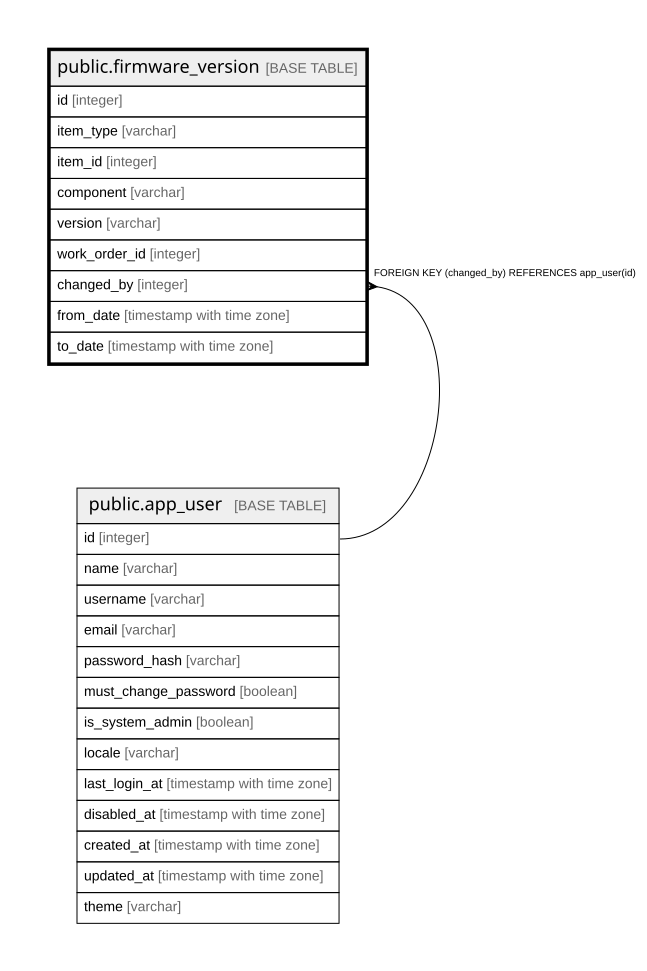

# public.firmware_version

## Description

ファームウェアの版 — 履歴テーブル（6.2）。

## Columns

| Name | Type | Default | Nullable | Children | Parents | Comment |
| ---- | ---- | ------- | -------- | -------- | ------- | ------- |
| id | integer |  | false |  |  |  |
| item_type | varchar |  | false |  |  | Device / PartInstance。**多態的参照のため外部キーを持てない** |
| item_id | integer |  | false |  |  |  |
| component | varchar |  | false |  |  |  |
| version | varchar |  | false |  |  |  |
| work_order_id | integer |  | true |  |  |  |
| changed_by | integer |  | false |  | [public.app_user](public.app_user.md) |  |
| from_date | timestamp with time zone |  | false |  |  |  |
| to_date | timestamp with time zone |  | true |  |  | null が現在有効な行 |

## Constraints

| Name | Type | Definition |
| ---- | ---- | ---------- |
| firmware_version_changed_by_fkey | FOREIGN KEY | FOREIGN KEY (changed_by) REFERENCES app_user(id) |
| firmware_version_pkey | PRIMARY KEY | PRIMARY KEY (id) |

## Indexes

| Name | Definition |
| ---- | ---------- |
| firmware_version_pkey | CREATE UNIQUE INDEX firmware_version_pkey ON public.firmware_version USING btree (id) |
| idx_firmware_version_current | CREATE INDEX idx_firmware_version_current ON public.firmware_version USING btree (item_type, item_id) WHERE (to_date IS NULL) |

## Relations

---

> Generated by [tbls](https://github.com/k1LoW/tbls)
