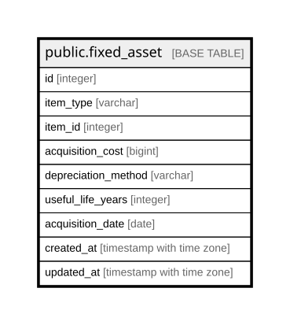

# public.fixed_asset

## Description

固定資産（10章）。**`disposal_date` と簿価を持たない**——廃棄は  
DEVICE_ASSIGNMENT の Disposed 行から、簿価は取得価額と経過期間から計算する  
（旧B-1）。持つと二重管理になり必ずずれる。  

## Columns

| Name | Type | Default | Nullable | Children | Parents | Comment |
| ---- | ---- | ------- | -------- | -------- | ------- | ------- |
| id | integer |  | false |  |  |  |
| item_type | varchar |  | false |  |  |  |
| item_id | integer |  | false |  |  |  |
| acquisition_cost | bigint | 0 | false |  |  | **最小通貨単位の整数**（24.2.1） |
| depreciation_method | varchar |  | false |  |  | straight_line / declining_balance |
| useful_life_years | integer |  | false |  |  |  |
| acquisition_date | date |  | false |  |  |  |
| created_at | timestamp with time zone |  | false |  |  |  |
| updated_at | timestamp with time zone |  | false |  |  |  |

## Constraints

| Name | Type | Definition |
| ---- | ---- | ---------- |
| fixed_asset_acquisition_cost_not_null | n | NOT NULL acquisition_cost |
| fixed_asset_acquisition_date_not_null | n | NOT NULL acquisition_date |
| fixed_asset_created_at_not_null | n | NOT NULL created_at |
| fixed_asset_depreciation_method_not_null | n | NOT NULL depreciation_method |
| fixed_asset_id_not_null | n | NOT NULL id |
| fixed_asset_item_id_not_null | n | NOT NULL item_id |
| fixed_asset_item_type_not_null | n | NOT NULL item_type |
| fixed_asset_updated_at_not_null | n | NOT NULL updated_at |
| fixed_asset_useful_life_years_not_null | n | NOT NULL useful_life_years |
| fixed_asset_pkey | PRIMARY KEY | PRIMARY KEY (id) |

## Indexes

| Name | Definition |
| ---- | ---------- |
| fixed_asset_pkey | CREATE UNIQUE INDEX fixed_asset_pkey ON public.fixed_asset USING btree (id) |
| idx_fixed_asset_target | CREATE INDEX idx_fixed_asset_target ON public.fixed_asset USING btree (item_type, item_id) |

## Relations

---

> Generated by [tbls](https://github.com/k1LoW/tbls)
