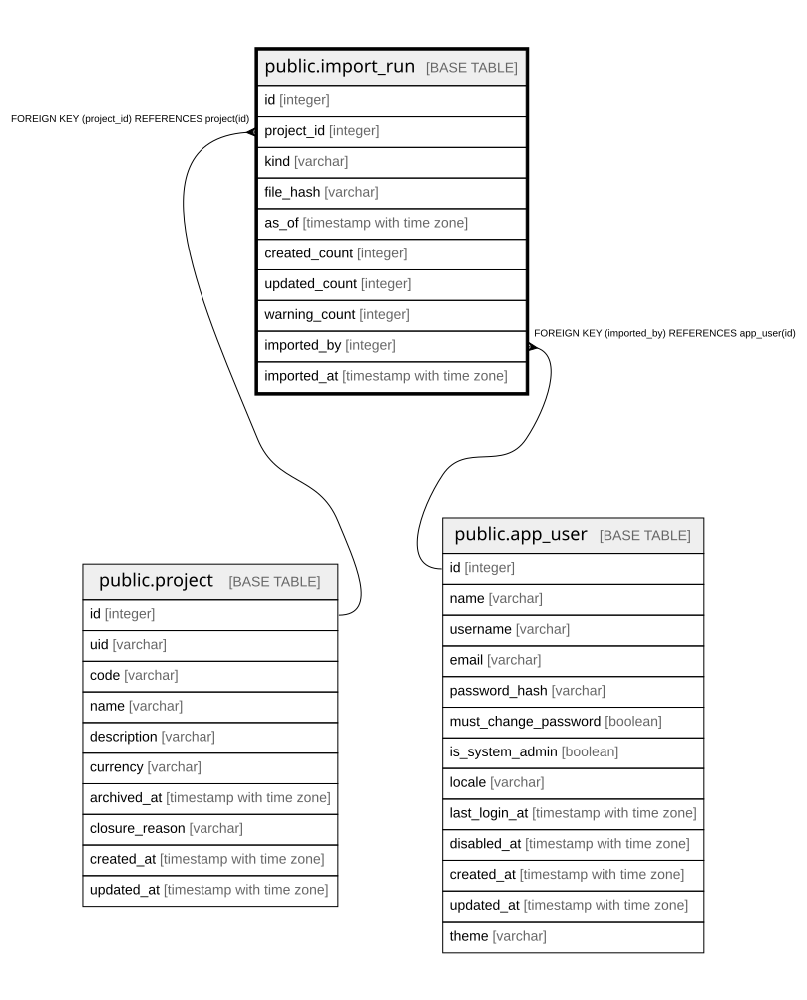

# public.import_run

## Description

取込の実行記録（23.7）。**「この不正なデータはどの取込で入ったか」を辿る**ためにある。  
取込では行ごとの監査ログを書かないため（24.4）、追跡はこのテーブルが担う。  

## Columns

| Name | Type | Default | Nullable | Children | Parents | Comment |
| ---- | ---- | ------- | -------- | -------- | ------- | ------- |
| id | integer |  | false |  |  |  |
| project_id | integer |  | true |  | [public.project](public.project.md) | カタログ取込はプロジェクトに属さないため null（18.1） |
| kind | varchar |  | false |  |  |  |
| file_hash | varchar |  | false |  |  | 同じファイルを二度流したかを後から判別できるようにする |
| as_of | timestamp with time zone |  | false |  |  | マニフェストで宣言された基準時刻。履歴行の `from_date` に使う（23.1） |
| created_count | integer | 0 | false |  |  |  |
| updated_count | integer | 0 | false |  |  |  |
| warning_count | integer | 0 | false |  |  |  |
| imported_by | integer |  | false |  | [public.app_user](public.app_user.md) |  |
| imported_at | timestamp with time zone |  | false |  |  |  |

## Constraints

| Name | Type | Definition |
| ---- | ---- | ---------- |
| import_run_as_of_not_null | n | NOT NULL as_of |
| import_run_created_count_not_null | n | NOT NULL created_count |
| import_run_file_hash_not_null | n | NOT NULL file_hash |
| import_run_id_not_null | n | NOT NULL id |
| import_run_imported_at_not_null | n | NOT NULL imported_at |
| import_run_imported_by_not_null | n | NOT NULL imported_by |
| import_run_kind_not_null | n | NOT NULL kind |
| import_run_updated_count_not_null | n | NOT NULL updated_count |
| import_run_warning_count_not_null | n | NOT NULL warning_count |
| import_run_imported_by_fkey | FOREIGN KEY | FOREIGN KEY (imported_by) REFERENCES app_user(id) |
| import_run_project_id_fkey | FOREIGN KEY | FOREIGN KEY (project_id) REFERENCES project(id) |
| import_run_pkey | PRIMARY KEY | PRIMARY KEY (id) |

## Indexes

| Name | Definition |
| ---- | ---------- |
| import_run_pkey | CREATE UNIQUE INDEX import_run_pkey ON public.import_run USING btree (id) |
| idx_import_run_project_imported_at | CREATE INDEX idx_import_run_project_imported_at ON public.import_run USING btree (project_id, imported_at) |
| idx_import_run_imported_by | CREATE INDEX idx_import_run_imported_by ON public.import_run USING btree (imported_by) |

## Relations

---

> Generated by [tbls](https://github.com/k1LoW/tbls)
