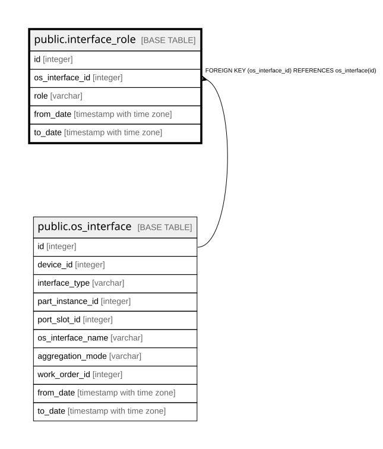

# public.interface_role

## Description

インターフェースの役割 — 履歴テーブル（8.5）。バックアップ用・vMotion用など目的別の区別で、  
セキュリティ境界を表す `zone` とは**別軸**である。  

## Columns

| Name | Type | Default | Nullable | Children | Parents | Comment |
| ---- | ---- | ------- | -------- | -------- | ------- | ------- |
| id | integer |  | false |  |  |  |
| os_interface_id | integer |  | false |  | [public.os_interface](public.os_interface.md) |  |
| role | varchar |  | false |  |  |  |
| from_date | timestamp with time zone |  | false |  |  |  |
| to_date | timestamp with time zone |  | true |  |  | null が現在有効な行 |

## Constraints

| Name | Type | Definition |
| ---- | ---- | ---------- |
| interface_role_os_interface_id_fkey | FOREIGN KEY | FOREIGN KEY (os_interface_id) REFERENCES os_interface(id) |
| interface_role_pkey | PRIMARY KEY | PRIMARY KEY (id) |

## Indexes

| Name | Definition |
| ---- | ---------- |
| interface_role_pkey | CREATE UNIQUE INDEX interface_role_pkey ON public.interface_role USING btree (id) |
| idx_interface_role_interface_current | CREATE INDEX idx_interface_role_interface_current ON public.interface_role USING btree (os_interface_id) WHERE (to_date IS NULL) |

## Relations

---

> Generated by [tbls](https://github.com/k1LoW/tbls)
