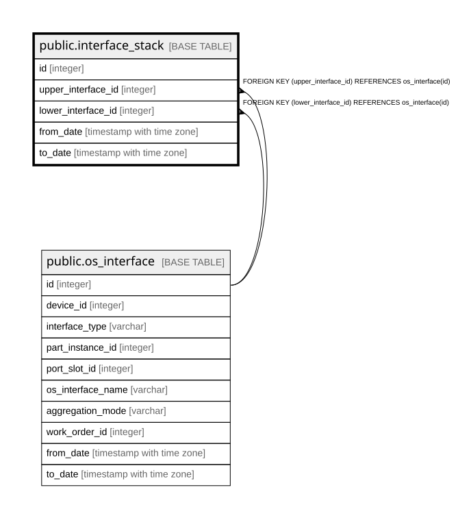

# public.interface_stack

## Description

インターフェースの積み重ね — 履歴テーブル（8.5）。  
**ボンド（1 upper : N lower）とVLANサブインターフェース（1 lower : N upper）の双方を  
扱うため中間テーブルにしている。**向きが逆なので片方向の外部キーでは表せない。  

## Columns

| Name | Type | Default | Nullable | Children | Parents | Comment |
| ---- | ---- | ------- | -------- | -------- | ------- | ------- |
| id | integer |  | false |  |  |  |
| upper_interface_id | integer |  | false |  | [public.os_interface](public.os_interface.md) |  |
| lower_interface_id | integer |  | false |  | [public.os_interface](public.os_interface.md) |  |
| from_date | timestamp with time zone |  | false |  |  |  |
| to_date | timestamp with time zone |  | true |  |  | null が現在有効な行 |

## Constraints

| Name | Type | Definition |
| ---- | ---- | ---------- |
| interface_stack_lower_interface_id_fkey | FOREIGN KEY | FOREIGN KEY (lower_interface_id) REFERENCES os_interface(id) |
| interface_stack_upper_interface_id_fkey | FOREIGN KEY | FOREIGN KEY (upper_interface_id) REFERENCES os_interface(id) |
| interface_stack_pkey | PRIMARY KEY | PRIMARY KEY (id) |

## Indexes

| Name | Definition |
| ---- | ---------- |
| interface_stack_pkey | CREATE UNIQUE INDEX interface_stack_pkey ON public.interface_stack USING btree (id) |
| idx_interface_stack_upper_current | CREATE INDEX idx_interface_stack_upper_current ON public.interface_stack USING btree (upper_interface_id) WHERE (to_date IS NULL) |
| idx_interface_stack_lower_current | CREATE INDEX idx_interface_stack_lower_current ON public.interface_stack USING btree (lower_interface_id) WHERE (to_date IS NULL) |

## Relations

---

> Generated by [tbls](https://github.com/k1LoW/tbls)
