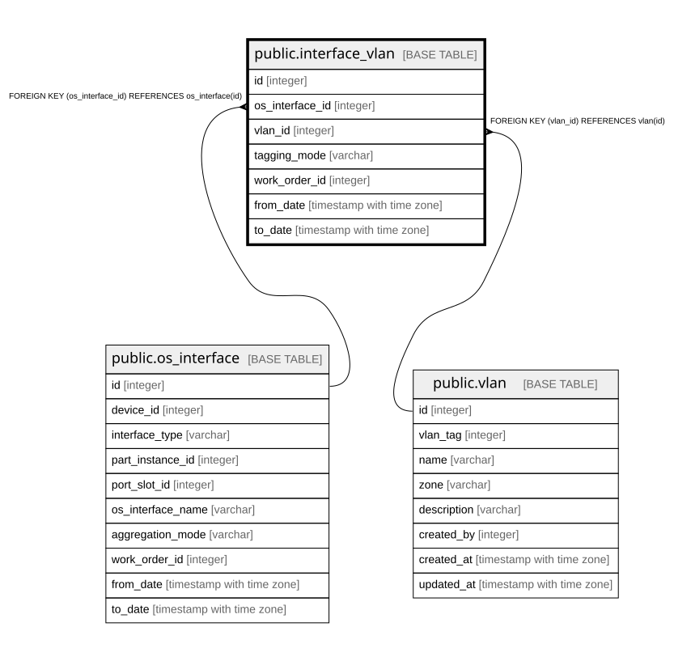

# public.interface_vlan

## Description

インターフェースに載るVLAN — 履歴テーブル（8.3、8.6）。

## Columns

| Name | Type | Default | Nullable | Children | Parents | Comment |
| ---- | ---- | ------- | -------- | -------- | ------- | ------- |
| id | integer |  | false |  |  |  |
| os_interface_id | integer |  | false |  | [public.os_interface](public.os_interface.md) |  |
| vlan_id | integer |  | false |  | [public.vlan](public.vlan.md) |  |
| tagging_mode | varchar |  | false |  |  | Untagged（ポートVLAN）/ Tagged（タグVLAN） |
| work_order_id | integer |  | true |  |  |  |
| from_date | timestamp with time zone |  | false |  |  |  |
| to_date | timestamp with time zone |  | true |  |  | null が現在有効な行 |

## Constraints

| Name | Type | Definition |
| ---- | ---- | ---------- |
| interface_vlan_from_date_not_null | n | NOT NULL from_date |
| interface_vlan_id_not_null | n | NOT NULL id |
| interface_vlan_os_interface_id_not_null | n | NOT NULL os_interface_id |
| interface_vlan_tagging_mode_not_null | n | NOT NULL tagging_mode |
| interface_vlan_vlan_id_not_null | n | NOT NULL vlan_id |
| interface_vlan_vlan_id_fkey | FOREIGN KEY | FOREIGN KEY (vlan_id) REFERENCES vlan(id) |
| interface_vlan_os_interface_id_fkey | FOREIGN KEY | FOREIGN KEY (os_interface_id) REFERENCES os_interface(id) |
| interface_vlan_pkey | PRIMARY KEY | PRIMARY KEY (id) |

## Indexes

| Name | Definition |
| ---- | ---------- |
| interface_vlan_pkey | CREATE UNIQUE INDEX interface_vlan_pkey ON public.interface_vlan USING btree (id) |
| idx_interface_vlan_interface_current | CREATE INDEX idx_interface_vlan_interface_current ON public.interface_vlan USING btree (os_interface_id) WHERE (to_date IS NULL) |
| idx_interface_vlan_vlan_current | CREATE INDEX idx_interface_vlan_vlan_current ON public.interface_vlan USING btree (vlan_id) WHERE (to_date IS NULL) |

## Relations

---

> Generated by [tbls](https://github.com/k1LoW/tbls)
