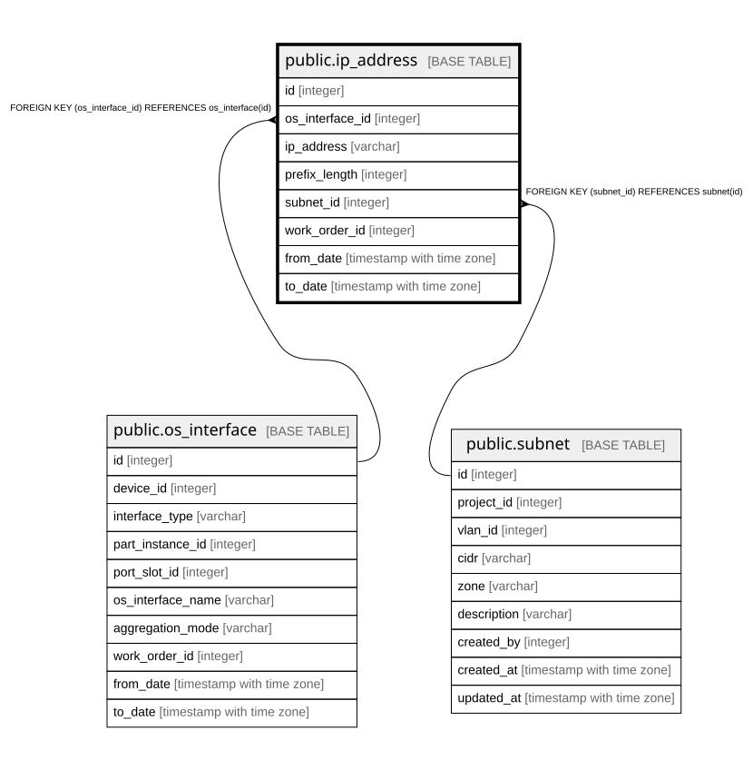

# public.ip_address

## Description

IPアドレス — 履歴テーブル（8.3、8.6、14章）。**`vlan_id` を持たない**（インターフェース  
側から辿る。8.6で廃止）。同一サブネット内の重複は部分インデックスで禁じている（14.2）。  

## Columns

| Name | Type | Default | Nullable | Children | Parents | Comment |
| ---- | ---- | ------- | -------- | -------- | ------- | ------- |
| id | integer |  | false |  |  |  |
| os_interface_id | integer |  | false |  | [public.os_interface](public.os_interface.md) |  |
| ip_address | varchar |  | false |  |  |  |
| prefix_length | integer |  | false |  |  |  |
| subnet_id | integer |  | true |  | [public.subnet](public.subnet.md) | null の行は重複禁止の対象外になる（NULL同士は重複と見なされない）  |
| work_order_id | integer |  | true |  |  |  |
| from_date | timestamp with time zone |  | false |  |  |  |
| to_date | timestamp with time zone |  | true |  |  | null が現在有効な行 |

## Constraints

| Name | Type | Definition |
| ---- | ---- | ---------- |
| ip_address_from_date_not_null | n | NOT NULL from_date |
| ip_address_id_not_null | n | NOT NULL id |
| ip_address_ip_address_not_null | n | NOT NULL ip_address |
| ip_address_os_interface_id_not_null | n | NOT NULL os_interface_id |
| ip_address_prefix_length_not_null | n | NOT NULL prefix_length |
| ip_address_subnet_id_fkey | FOREIGN KEY | FOREIGN KEY (subnet_id) REFERENCES subnet(id) |
| ip_address_os_interface_id_fkey | FOREIGN KEY | FOREIGN KEY (os_interface_id) REFERENCES os_interface(id) |
| ip_address_pkey | PRIMARY KEY | PRIMARY KEY (id) |

## Indexes

| Name | Definition |
| ---- | ---------- |
| ip_address_pkey | CREATE UNIQUE INDEX ip_address_pkey ON public.ip_address USING btree (id) |
| idx_ip_address_interface_current | CREATE INDEX idx_ip_address_interface_current ON public.ip_address USING btree (os_interface_id) WHERE (to_date IS NULL) |
| uq_ip_address_subnet_current | CREATE UNIQUE INDEX uq_ip_address_subnet_current ON public.ip_address USING btree (subnet_id, ip_address) WHERE (to_date IS NULL) |

## Relations

---

> Generated by [tbls](https://github.com/k1LoW/tbls)
