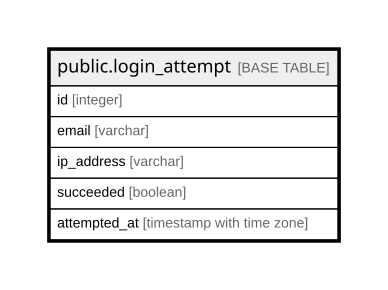

# public.login_attempt

## Description

ログイン試行。レート制限に使う。**存在しない利用者への試行も記録する**ため  
app_user への外部キーを持たない（20.4）。  

## Columns

| Name | Type | Default | Nullable | Children | Parents | Comment |
| ---- | ---- | ------- | -------- | -------- | ------- | ------- |
| id | integer |  | false |  |  |  |
| email | varchar |  | false |  |  |  |
| ip_address | varchar |  | false |  |  |  |
| succeeded | boolean |  | false |  |  |  |
| attempted_at | timestamp with time zone |  | false |  |  |  |

## Constraints

| Name | Type | Definition |
| ---- | ---- | ---------- |
| login_attempt_pkey | PRIMARY KEY | PRIMARY KEY (id) |

## Indexes

| Name | Definition |
| ---- | ---------- |
| login_attempt_pkey | CREATE UNIQUE INDEX login_attempt_pkey ON public.login_attempt USING btree (id) |
| idx_login_attempt_email_attempted_at | CREATE INDEX idx_login_attempt_email_attempted_at ON public.login_attempt USING btree (email, attempted_at) |
| idx_login_attempt_ip_attempted_at | CREATE INDEX idx_login_attempt_ip_attempted_at ON public.login_attempt USING btree (ip_address, attempted_at) |

## Relations

---

> Generated by [tbls](https://github.com/k1LoW/tbls)
