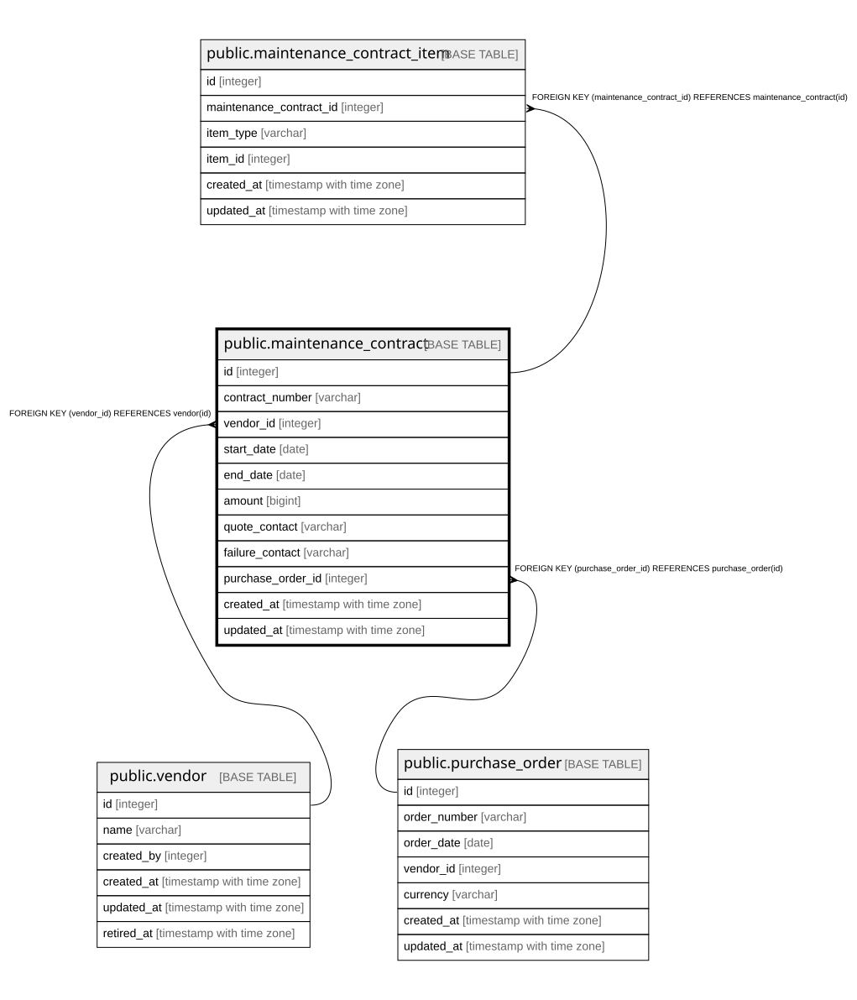

# public.maintenance_contract

## Description

保守契約（10章）。

## Columns

| Name | Type | Default | Nullable | Children | Parents | Comment |
| ---- | ---- | ------- | -------- | -------- | ------- | ------- |
| id | integer |  | false | [public.maintenance_contract_item](public.maintenance_contract_item.md) |  |  |
| contract_number | varchar |  | false |  |  |  |
| vendor_id | integer |  | false |  | [public.vendor](public.vendor.md) |  |
| start_date | date |  | false |  |  |  |
| end_date | date |  | false |  |  | **保守期限はこの列のみが正**（旧B-2）。機器側に保守期限を持たない |
| amount | bigint | 0 | false |  |  | **最小通貨単位の整数**（24.2.1） |
| quote_contact | varchar | ''::character varying | false |  |  |  |
| failure_contact | varchar | ''::character varying | false |  |  |  |
| purchase_order_id | integer |  | true |  | [public.purchase_order](public.purchase_order.md) |  |
| created_at | timestamp with time zone |  | false |  |  |  |
| updated_at | timestamp with time zone |  | false |  |  |  |

## Constraints

| Name | Type | Definition |
| ---- | ---- | ---------- |
| maintenance_contract_amount_not_null | n | NOT NULL amount |
| maintenance_contract_contract_number_not_null | n | NOT NULL contract_number |
| maintenance_contract_created_at_not_null | n | NOT NULL created_at |
| maintenance_contract_end_date_not_null | n | NOT NULL end_date |
| maintenance_contract_failure_contact_not_null | n | NOT NULL failure_contact |
| maintenance_contract_id_not_null | n | NOT NULL id |
| maintenance_contract_quote_contact_not_null | n | NOT NULL quote_contact |
| maintenance_contract_start_date_not_null | n | NOT NULL start_date |
| maintenance_contract_updated_at_not_null | n | NOT NULL updated_at |
| maintenance_contract_vendor_id_not_null | n | NOT NULL vendor_id |
| maintenance_contract_vendor_id_fkey | FOREIGN KEY | FOREIGN KEY (vendor_id) REFERENCES vendor(id) |
| maintenance_contract_purchase_order_id_fkey | FOREIGN KEY | FOREIGN KEY (purchase_order_id) REFERENCES purchase_order(id) |
| maintenance_contract_pkey | PRIMARY KEY | PRIMARY KEY (id) |

## Indexes

| Name | Definition |
| ---- | ---------- |
| maintenance_contract_pkey | CREATE UNIQUE INDEX maintenance_contract_pkey ON public.maintenance_contract USING btree (id) |
| idx_maintenance_contract_vendor | CREATE INDEX idx_maintenance_contract_vendor ON public.maintenance_contract USING btree (vendor_id) |
| idx_maintenance_contract_purchase_order | CREATE INDEX idx_maintenance_contract_purchase_order ON public.maintenance_contract USING btree (purchase_order_id) |
| idx_maintenance_contract_end_date | CREATE INDEX idx_maintenance_contract_end_date ON public.maintenance_contract USING btree (end_date) |

## Relations

---

> Generated by [tbls](https://github.com/k1LoW/tbls)
