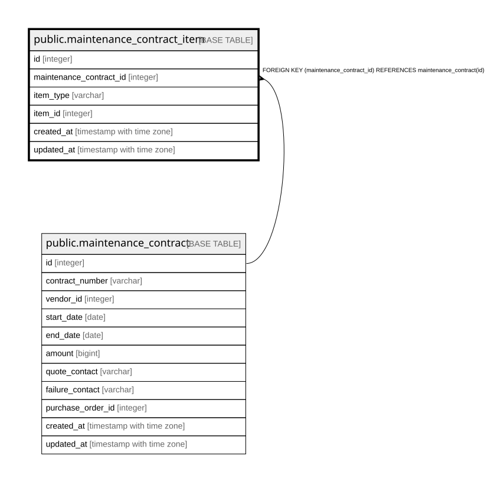

# public.maintenance_contract_item

## Description

保守契約の対象（10章）。多態的参照のため外部キーを持てない。

## Columns

| Name | Type | Default | Nullable | Children | Parents | Comment |
| ---- | ---- | ------- | -------- | -------- | ------- | ------- |
| id | integer |  | false |  |  |  |
| maintenance_contract_id | integer |  | false |  | [public.maintenance_contract](public.maintenance_contract.md) |  |
| item_type | varchar |  | false |  |  |  |
| item_id | integer |  | false |  |  |  |
| created_at | timestamp with time zone |  | false |  |  |  |
| updated_at | timestamp with time zone |  | false |  |  |  |

## Constraints

| Name | Type | Definition |
| ---- | ---- | ---------- |
| maintenance_contract_item_created_at_not_null | n | NOT NULL created_at |
| maintenance_contract_item_id_not_null | n | NOT NULL id |
| maintenance_contract_item_item_id_not_null | n | NOT NULL item_id |
| maintenance_contract_item_item_type_not_null | n | NOT NULL item_type |
| maintenance_contract_item_maintenance_contract_id_not_null | n | NOT NULL maintenance_contract_id |
| maintenance_contract_item_updated_at_not_null | n | NOT NULL updated_at |
| maintenance_contract_item_maintenance_contract_id_fkey | FOREIGN KEY | FOREIGN KEY (maintenance_contract_id) REFERENCES maintenance_contract(id) |
| maintenance_contract_item_pkey | PRIMARY KEY | PRIMARY KEY (id) |

## Indexes

| Name | Definition |
| ---- | ---------- |
| maintenance_contract_item_pkey | CREATE UNIQUE INDEX maintenance_contract_item_pkey ON public.maintenance_contract_item USING btree (id) |
| idx_maintenance_contract_item_contract | CREATE INDEX idx_maintenance_contract_item_contract ON public.maintenance_contract_item USING btree (maintenance_contract_id) |
| idx_maintenance_contract_item_target | CREATE INDEX idx_maintenance_contract_item_target ON public.maintenance_contract_item USING btree (item_type, item_id) |

## Relations

---

> Generated by [tbls](https://github.com/k1LoW/tbls)
