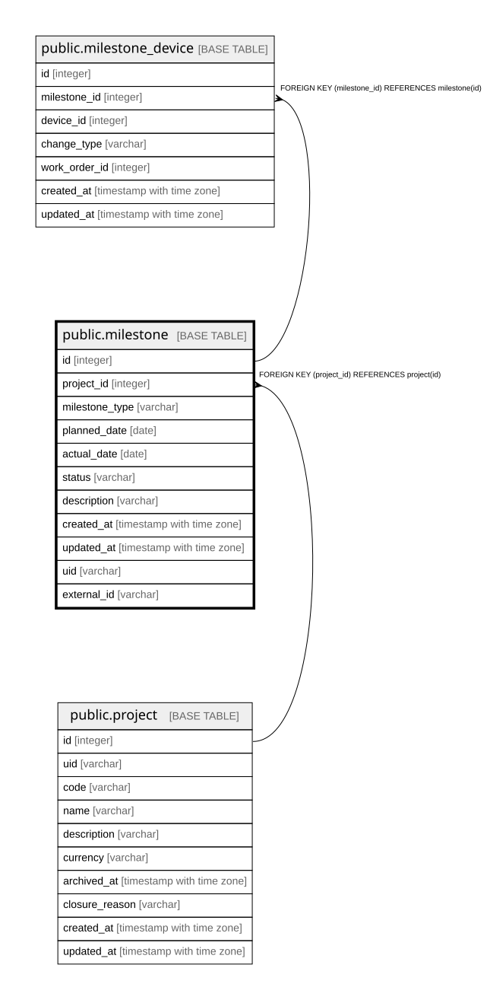

# public.milestone

## Description

マイルストーン（10.4）。**予定と実績を別の列で持つ。**片方に上書きすると  
「当初いつの予定だったか」が失われ、QCDの「D」を定量的に見られなくなる（5.1）。  

## Columns

| Name | Type | Default | Nullable | Children | Parents | Comment |
| ---- | ---- | ------- | -------- | -------- | ------- | ------- |
| id | integer |  | false | [public.milestone_device](public.milestone_device.md) |  |  |
| project_id | integer |  | false |  | [public.project](public.project.md) |  |
| milestone_type | varchar |  | false |  |  | ServiceStart / ServiceUpdate / ServiceMaintenance / ServiceEnd |
| planned_date | date |  | false |  |  | **`date` のまま。**同日内の順序を問わないため（C-5） |
| actual_date | date |  | true |  |  |  |
| status | varchar |  | false |  |  |  |
| description | varchar | ''::character varying | false |  |  |  |
| created_at | timestamp with time zone |  | false |  |  |  |
| updated_at | timestamp with time zone |  | false |  |  |  |

## Constraints

| Name | Type | Definition |
| ---- | ---- | ---------- |
| milestone_created_at_not_null | n | NOT NULL created_at |
| milestone_description_not_null | n | NOT NULL description |
| milestone_id_not_null | n | NOT NULL id |
| milestone_milestone_type_not_null | n | NOT NULL milestone_type |
| milestone_planned_date_not_null | n | NOT NULL planned_date |
| milestone_project_id_not_null | n | NOT NULL project_id |
| milestone_status_not_null | n | NOT NULL status |
| milestone_updated_at_not_null | n | NOT NULL updated_at |
| milestone_project_id_fkey | FOREIGN KEY | FOREIGN KEY (project_id) REFERENCES project(id) |
| milestone_pkey | PRIMARY KEY | PRIMARY KEY (id) |

## Indexes

| Name | Definition |
| ---- | ---------- |
| milestone_pkey | CREATE UNIQUE INDEX milestone_pkey ON public.milestone USING btree (id) |
| idx_milestone_project | CREATE INDEX idx_milestone_project ON public.milestone USING btree (project_id) |
| idx_milestone_planned_date | CREATE INDEX idx_milestone_planned_date ON public.milestone USING btree (planned_date) |

## Relations

---

> Generated by [tbls](https://github.com/k1LoW/tbls)
