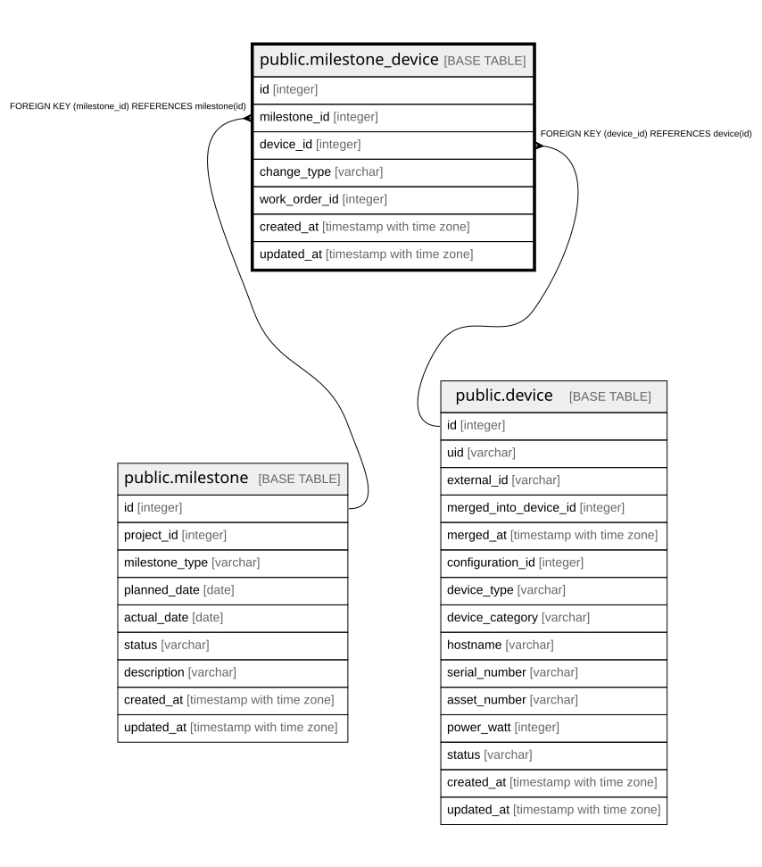

# public.milestone_device

## Description

マイルストーンと機器の対応（10.4）。

## Columns

| Name | Type | Default | Nullable | Children | Parents | Comment |
| ---- | ---- | ------- | -------- | -------- | ------- | ------- |
| id | integer |  | false |  |  |  |
| milestone_id | integer |  | false |  | [public.milestone](public.milestone.md) |  |
| device_id | integer |  | false |  | [public.device](public.device.md) |  |
| change_type | varchar |  | false |  |  | addition / relocation / removal |
| work_order_id | integer |  | true |  |  | **WORK_ORDER未作成のため外部キーは未設定** |
| created_at | timestamp with time zone |  | false |  |  |  |
| updated_at | timestamp with time zone |  | false |  |  |  |

## Constraints

| Name | Type | Definition |
| ---- | ---- | ---------- |
| milestone_device_device_id_fkey | FOREIGN KEY | FOREIGN KEY (device_id) REFERENCES device(id) |
| milestone_device_milestone_id_fkey | FOREIGN KEY | FOREIGN KEY (milestone_id) REFERENCES milestone(id) |
| milestone_device_pkey | PRIMARY KEY | PRIMARY KEY (id) |

## Indexes

| Name | Definition |
| ---- | ---------- |
| milestone_device_pkey | CREATE UNIQUE INDEX milestone_device_pkey ON public.milestone_device USING btree (id) |
| idx_milestone_device_milestone | CREATE INDEX idx_milestone_device_milestone ON public.milestone_device USING btree (milestone_id) |
| idx_milestone_device_device | CREATE INDEX idx_milestone_device_device ON public.milestone_device USING btree (device_id) |

## Relations

---

> Generated by [tbls](https://github.com/k1LoW/tbls)
