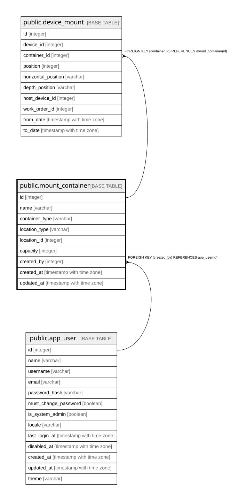

# public.mount_container

## Description

機器を載せる什器（12章）。

## Columns

| Name | Type | Default | Nullable | Children | Parents | Comment |
| ---- | ---- | ------- | -------- | -------- | ------- | ------- |
| id | integer |  | false | [public.device_mount](public.device_mount.md) |  |  |
| name | varchar |  | false |  |  |  |
| container_type | varchar |  | false |  |  |  |
| location_type | varchar |  | false |  |  | Warehouse / Project。多態的参照のため外部キーを持てない |
| location_id | integer |  | false |  |  |  |
| capacity | integer |  | true |  |  | ラックのU数、棚の段数。**制約ではなく目安。**超過はエラーではなく警告として扱う（不変条件6）  |
| created_by | integer |  | false |  | [public.app_user](public.app_user.md) |  |
| created_at | timestamp with time zone |  | false |  |  |  |
| updated_at | timestamp with time zone |  | false |  |  |  |

## Constraints

| Name | Type | Definition |
| ---- | ---- | ---------- |
| mount_container_created_by_fkey | FOREIGN KEY | FOREIGN KEY (created_by) REFERENCES app_user(id) |
| mount_container_pkey | PRIMARY KEY | PRIMARY KEY (id) |

## Indexes

| Name | Definition |
| ---- | ---------- |
| mount_container_pkey | CREATE UNIQUE INDEX mount_container_pkey ON public.mount_container USING btree (id) |
| idx_mount_container_location | CREATE INDEX idx_mount_container_location ON public.mount_container USING btree (location_type, location_id) |

## Relations

---

> Generated by [tbls](https://github.com/k1LoW/tbls)
