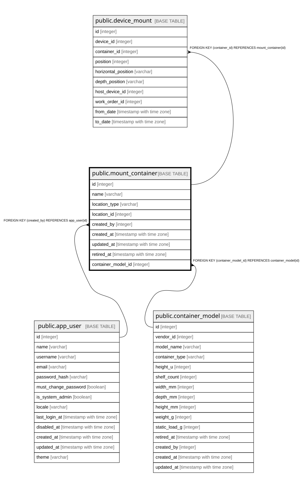

# public.mount_container

## Description

機器を載せる設備・什器（ラック・机・棚、12章）。名前は置き場所の中で一意で、大文字小文字を区別しない（撤去していないものに限る、#204）

## Columns

| Name | Type | Default | Nullable | Children | Parents | Comment |
| ---- | ---- | ------- | -------- | -------- | ------- | ------- |
| id | integer |  | false | [public.device_mount](public.device_mount.md) |  |  |
| name | varchar |  | false |  |  |  |
| container_type | varchar |  | false |  |  |  |
| location_type | varchar |  | false |  |  | Warehouse / Project。多態的参照のため外部キーを持てない |
| location_id | integer |  | false |  |  |  |
| capacity | integer |  | true |  |  | ラックのU数、棚の段数。**制約ではなく目安。**超過はエラーではなく警告として扱う（不変条件6）  |
| created_by | integer |  | false |  | [public.app_user](public.app_user.md) |  |
| created_at | timestamp with time zone |  | false |  |  |  |
| updated_at | timestamp with time zone |  | false |  |  |  |
| retired_at | timestamp with time zone |  | true |  |  | null = 現役。搭載の履歴や費用の記録が指し続けるため、使ったことのある設備は消さず撤去済みにする（#204） |

## Constraints

| Name | Type | Definition |
| ---- | ---- | ---------- |
| mount_container_container_type_not_null | n | NOT NULL container_type |
| mount_container_created_at_not_null | n | NOT NULL created_at |
| mount_container_created_by_not_null | n | NOT NULL created_by |
| mount_container_id_not_null | n | NOT NULL id |
| mount_container_location_id_not_null | n | NOT NULL location_id |
| mount_container_location_type_not_null | n | NOT NULL location_type |
| mount_container_name_not_null | n | NOT NULL name |
| mount_container_updated_at_not_null | n | NOT NULL updated_at |
| mount_container_created_by_fkey | FOREIGN KEY | FOREIGN KEY (created_by) REFERENCES app_user(id) |
| mount_container_pkey | PRIMARY KEY | PRIMARY KEY (id) |

## Indexes

| Name | Definition |
| ---- | ---------- |
| mount_container_pkey | CREATE UNIQUE INDEX mount_container_pkey ON public.mount_container USING btree (id) |
| idx_mount_container_location | CREATE INDEX idx_mount_container_location ON public.mount_container USING btree (location_type, location_id) |
| idx_mount_container_name_active | CREATE UNIQUE INDEX idx_mount_container_name_active ON public.mount_container USING btree (location_type, location_id, lower((name)::text)) WHERE (retired_at IS NULL) |

## Relations

---

> Generated by [tbls](https://github.com/k1LoW/tbls)
