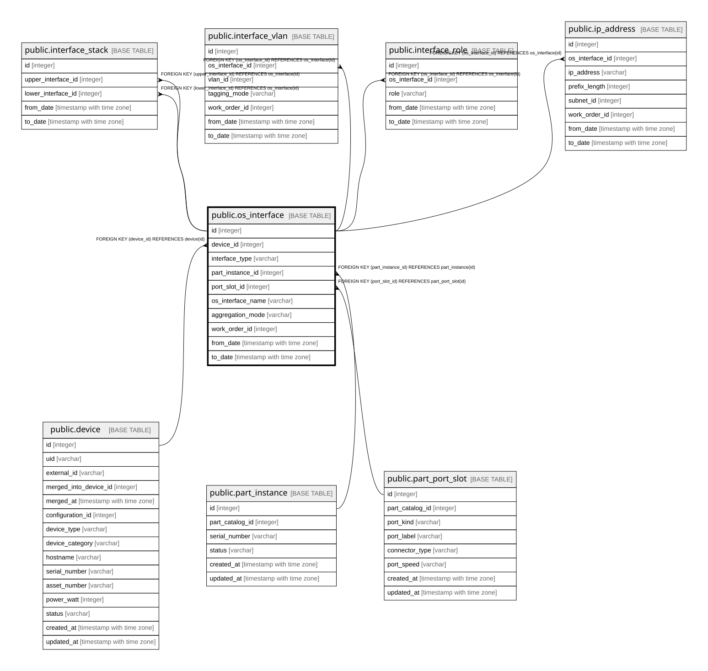

# public.os_interface

## Description

OSから見えるインターフェース — 履歴テーブル（8.3、8.5）。  
**物理ポートではなくこちらを中心に置く。**ボンド・VLANサブインターフェース・SVI・  
VMの仮想NICは物理ポートに1対1で対応しない。  

## Columns

| Name | Type | Default | Nullable | Children | Parents | Comment |
| ---- | ---- | ------- | -------- | -------- | ------- | ------- |
| id | integer |  | false | [public.interface_stack](public.interface_stack.md) [public.interface_vlan](public.interface_vlan.md) [public.interface_role](public.interface_role.md) [public.ip_address](public.ip_address.md) |  |  |
| device_id | integer |  | false |  | [public.device](public.device.md) | **必須。**物理ポートを持たないインターフェースがあり、ポートから機器を導出できない（8.3）  |
| interface_type | varchar |  | false |  |  |  |
| part_instance_id | integer |  | true |  | [public.part_instance](public.part_instance.md) | interface_type=Physical のときのみ意味を持つ |
| port_slot_id | integer |  | true |  | [public.part_port_slot](public.part_port_slot.md) | 同上 |
| os_interface_name | varchar |  | false |  |  |  |
| aggregation_mode | varchar |  | true |  |  | LACP / Static / ActiveBackup。interface_type=Bond のみ |
| work_order_id | integer |  | true |  |  |  |
| from_date | timestamp with time zone |  | false |  |  |  |
| to_date | timestamp with time zone |  | true |  |  | null が現在有効な行 |

## Constraints

| Name | Type | Definition |
| ---- | ---- | ---------- |
| os_interface_device_id_not_null | n | NOT NULL device_id |
| os_interface_from_date_not_null | n | NOT NULL from_date |
| os_interface_id_not_null | n | NOT NULL id |
| os_interface_interface_type_not_null | n | NOT NULL interface_type |
| os_interface_os_interface_name_not_null | n | NOT NULL os_interface_name |
| os_interface_port_slot_id_fkey | FOREIGN KEY | FOREIGN KEY (port_slot_id) REFERENCES part_port_slot(id) |
| os_interface_device_id_fkey | FOREIGN KEY | FOREIGN KEY (device_id) REFERENCES device(id) |
| os_interface_part_instance_id_fkey | FOREIGN KEY | FOREIGN KEY (part_instance_id) REFERENCES part_instance(id) |
| os_interface_pkey | PRIMARY KEY | PRIMARY KEY (id) |

## Indexes

| Name | Definition |
| ---- | ---------- |
| os_interface_pkey | CREATE UNIQUE INDEX os_interface_pkey ON public.os_interface USING btree (id) |
| idx_os_interface_device_current | CREATE INDEX idx_os_interface_device_current ON public.os_interface USING btree (device_id) WHERE (to_date IS NULL) |
| idx_os_interface_port_slot_current | CREATE INDEX idx_os_interface_port_slot_current ON public.os_interface USING btree (port_slot_id) WHERE (to_date IS NULL) |
| idx_os_interface_part_instance | CREATE INDEX idx_os_interface_part_instance ON public.os_interface USING btree (part_instance_id) |

## Relations

---

> Generated by [tbls](https://github.com/k1LoW/tbls)
