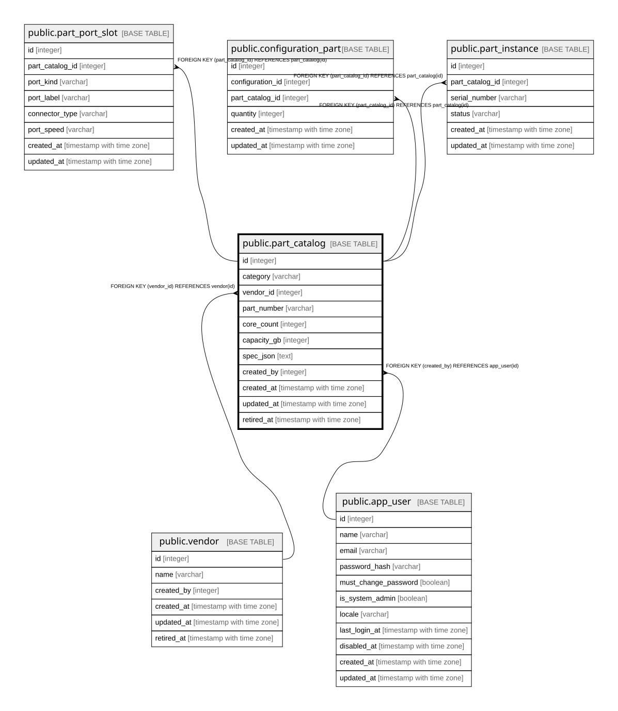

# public.part_catalog

## Description

部品カタログ。**集計に使う値だけをカラム化する**ハイブリッド方針（6.4）。  

## Columns

| Name | Type | Default | Nullable | Children | Parents | Comment |
| ---- | ---- | ------- | -------- | -------- | ------- | ------- |
| id | integer |  | false | [public.part_port_slot](public.part_port_slot.md) [public.configuration_part](public.configuration_part.md) [public.part_instance](public.part_instance.md) |  |  |
| category | varchar |  | false |  |  |  |
| vendor_id | integer |  | false |  | [public.vendor](public.vendor.md) |  |
| part_number | varchar |  | false |  |  |  |
| core_count | integer |  | true |  |  | 横断集計の対象のため実カラム。該当しない部品では null |
| capacity_gb | integer |  | true |  |  | 同上 |
| spec_json | text | '{}'::text | false |  |  | 集計しない仕様。**JSONは文字列で持つ**（24.2.3。jsonb固有演算子を使わないため） |
| created_by | integer |  | false |  | [public.app_user](public.app_user.md) |  |
| created_at | timestamp with time zone |  | false |  |  |  |
| updated_at | timestamp with time zone |  | false |  |  |  |
| retired_at | timestamp with time zone |  | true |  |  |  |
| merged_into_part_catalog_id | integer |  | true |  |  |  |
| merged_at | timestamp with time zone |  | true |  |  |  |

## Constraints

| Name | Type | Definition |
| ---- | ---- | ---------- |
| part_catalog_created_by_fkey | FOREIGN KEY | FOREIGN KEY (created_by) REFERENCES app_user(id) |
| part_catalog_vendor_id_fkey | FOREIGN KEY | FOREIGN KEY (vendor_id) REFERENCES vendor(id) |
| part_catalog_pkey | PRIMARY KEY | PRIMARY KEY (id) |

## Indexes

| Name | Definition |
| ---- | ---------- |
| part_catalog_pkey | CREATE UNIQUE INDEX part_catalog_pkey ON public.part_catalog USING btree (id) |
| uq_part_catalog_vendor_part_number | CREATE UNIQUE INDEX uq_part_catalog_vendor_part_number ON public.part_catalog USING btree (vendor_id, part_number) |
| idx_part_catalog_retired_at | CREATE INDEX idx_part_catalog_retired_at ON public.part_catalog USING btree (retired_at) |
| idx_part_catalog_merged_into | CREATE INDEX idx_part_catalog_merged_into ON public.part_catalog USING btree (merged_into_part_catalog_id) |

## Relations

---

> Generated by [tbls](https://github.com/k1LoW/tbls)
