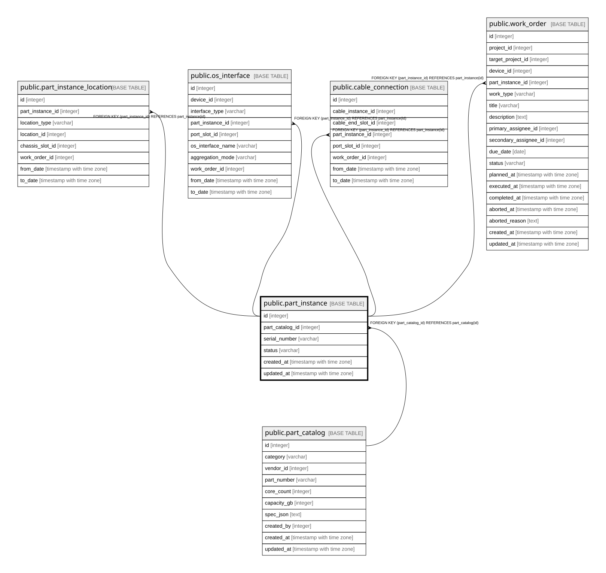

# public.part_instance

## Description

部品の実物（6.2）。

## Columns

| Name | Type | Default | Nullable | Children | Parents | Comment |
| ---- | ---- | ------- | -------- | -------- | ------- | ------- |
| id | integer |  | false | [public.part_instance_location](public.part_instance_location.md) [public.os_interface](public.os_interface.md) [public.cable_connection](public.cable_connection.md) |  |  |
| part_catalog_id | integer |  | false |  | [public.part_catalog](public.part_catalog.md) |  |
| serial_number | varchar |  | true |  |  |  |
| status | varchar |  | false |  |  |  |
| created_at | timestamp with time zone |  | false |  |  |  |
| updated_at | timestamp with time zone |  | false |  |  |  |

## Constraints

| Name | Type | Definition |
| ---- | ---- | ---------- |
| part_instance_part_catalog_id_fkey | FOREIGN KEY | FOREIGN KEY (part_catalog_id) REFERENCES part_catalog(id) |
| part_instance_pkey | PRIMARY KEY | PRIMARY KEY (id) |

## Indexes

| Name | Definition |
| ---- | ---------- |
| part_instance_pkey | CREATE UNIQUE INDEX part_instance_pkey ON public.part_instance USING btree (id) |
| idx_part_instance_catalog | CREATE INDEX idx_part_instance_catalog ON public.part_instance USING btree (part_catalog_id) |

## Relations

---

> Generated by [tbls](https://github.com/k1LoW/tbls)
