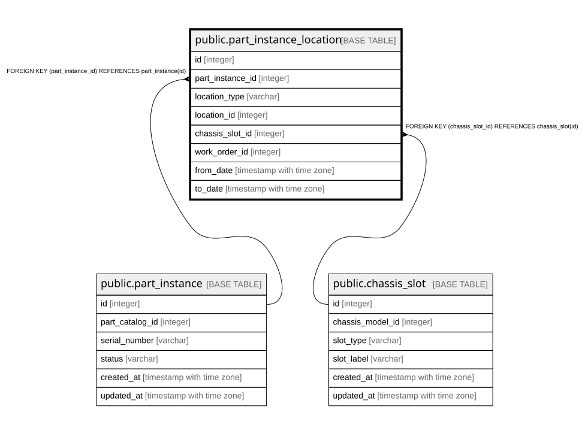

# public.part_instance_location

## Description

部品の所在 — 履歴テーブル（6.2、12.4）。

## Columns

| Name | Type | Default | Nullable | Children | Parents | Comment |
| ---- | ---- | ------- | -------- | -------- | ------- | ------- |
| id | integer |  | false |  |  |  |
| part_instance_id | integer |  | false |  | [public.part_instance](public.part_instance.md) |  |
| location_type | varchar |  | false |  |  |  |
| location_id | integer |  | true |  |  |  |
| chassis_slot_id | integer |  | true |  | [public.chassis_slot](public.chassis_slot.md) | **任意項目。**どのスロットに挿さっているかまでは求めない（6.2）。 求めると取込のたびに実機を開けることになる  |
| work_order_id | integer |  | true |  |  |  |
| from_date | timestamp with time zone |  | false |  |  |  |
| to_date | timestamp with time zone |  | true |  |  | null が現在有効な行 |

## Constraints

| Name | Type | Definition |
| ---- | ---- | ---------- |
| part_instance_location_from_date_not_null | n | NOT NULL from_date |
| part_instance_location_id_not_null | n | NOT NULL id |
| part_instance_location_location_type_not_null | n | NOT NULL location_type |
| part_instance_location_part_instance_id_not_null | n | NOT NULL part_instance_id |
| part_instance_location_chassis_slot_id_fkey | FOREIGN KEY | FOREIGN KEY (chassis_slot_id) REFERENCES chassis_slot(id) |
| part_instance_location_part_instance_id_fkey | FOREIGN KEY | FOREIGN KEY (part_instance_id) REFERENCES part_instance(id) |
| part_instance_location_pkey | PRIMARY KEY | PRIMARY KEY (id) |

## Indexes

| Name | Definition |
| ---- | ---------- |
| part_instance_location_pkey | CREATE UNIQUE INDEX part_instance_location_pkey ON public.part_instance_location USING btree (id) |
| idx_part_instance_location_current | CREATE INDEX idx_part_instance_location_current ON public.part_instance_location USING btree (part_instance_id) WHERE (to_date IS NULL) |
| idx_part_instance_location_target | CREATE INDEX idx_part_instance_location_target ON public.part_instance_location USING btree (location_type, location_id) WHERE (to_date IS NULL) |
| idx_part_instance_location_chassis_slot | CREATE INDEX idx_part_instance_location_chassis_slot ON public.part_instance_location USING btree (chassis_slot_id) |

## Relations

---

> Generated by [tbls](https://github.com/k1LoW/tbls)
