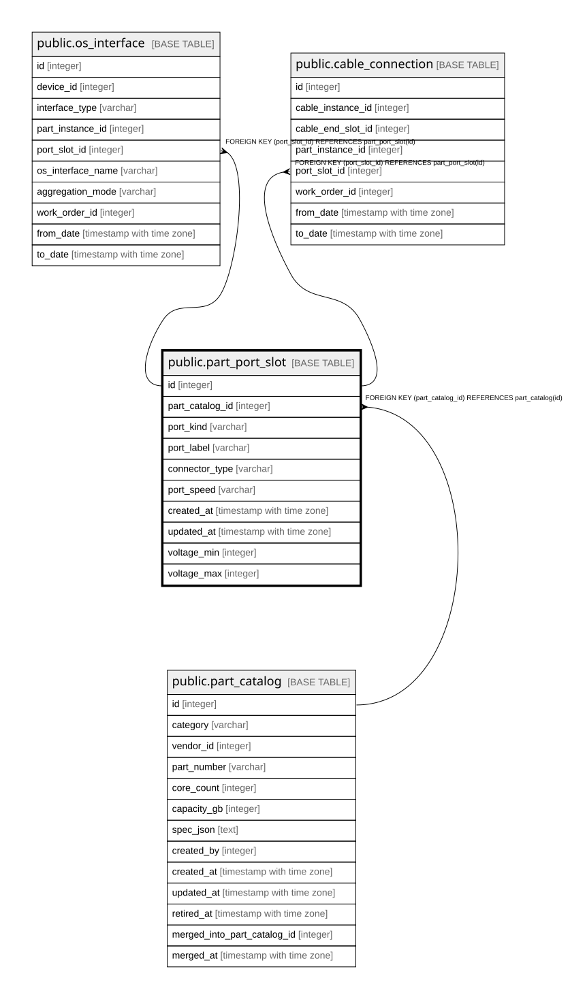

# public.part_port_slot

## Description

部品が備えるポート（8.3、8.7）。

## Columns

| Name | Type | Default | Nullable | Children | Parents | Comment |
| ---- | ---- | ------- | -------- | -------- | ------- | ------- |
| id | integer |  | false | [public.os_interface](public.os_interface.md) [public.cable_connection](public.cable_connection.md) |  |  |
| part_catalog_id | integer |  | false |  | [public.part_catalog](public.part_catalog.md) |  |
| port_kind | varchar |  | false |  |  |  |
| port_label | varchar |  | false |  |  |  |
| connector_type | varchar |  | false |  |  |  |
| port_speed | varchar |  | true |  |  | port_kind=Network のときのみ意味を持つ |
| created_at | timestamp with time zone |  | false |  |  |  |
| updated_at | timestamp with time zone |  | false |  |  |  |
| voltage_min | integer |  | true |  |  |  |
| voltage_max | integer |  | true |  |  |  |

## Constraints

| Name | Type | Definition |
| ---- | ---- | ---------- |
| part_port_slot_part_catalog_id_fkey | FOREIGN KEY | FOREIGN KEY (part_catalog_id) REFERENCES part_catalog(id) |
| part_port_slot_pkey | PRIMARY KEY | PRIMARY KEY (id) |

## Indexes

| Name | Definition |
| ---- | ---------- |
| part_port_slot_pkey | CREATE UNIQUE INDEX part_port_slot_pkey ON public.part_port_slot USING btree (id) |
| idx_part_port_slot_part_catalog | CREATE INDEX idx_part_port_slot_part_catalog ON public.part_port_slot USING btree (part_catalog_id) |

## Relations

---

> Generated by [tbls](https://github.com/k1LoW/tbls)
