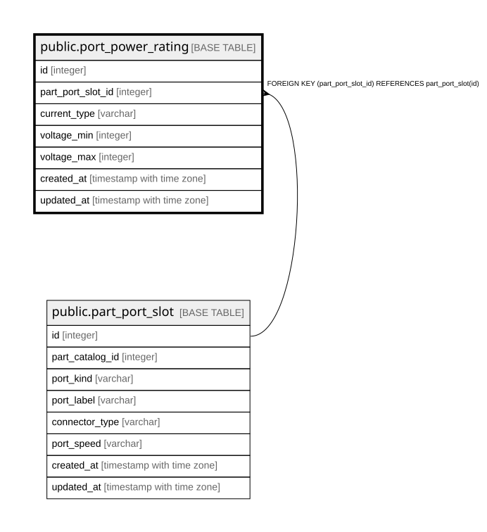

# public.port_power_rating

## Description

ポートが受け付ける給電方式と定格電圧（12.7）。**給電方式ごとに1行。**  
交流と直流の双方を受けるPSUが実在するため、`PART_PORT_SLOT` の列にはできない。  

## Columns

| Name | Type | Default | Nullable | Children | Parents | Comment |
| ---- | ---- | ------- | -------- | -------- | ------- | ------- |
| id | integer |  | false |  |  |  |
| part_port_slot_id | integer |  | false |  | [public.part_port_slot](public.part_port_slot.md) |  |
| current_type | varchar |  | false |  |  |  |
| voltage_min | integer |  | false |  |  | **DCは負値をとりうる。**絶対値ではなく符号を含めた大小で扱う （-48V電源は -72 が下限、-40 が上限）  |
| voltage_max | integer |  | false |  |  | 同上 |
| created_at | timestamp with time zone |  | false |  |  |  |
| updated_at | timestamp with time zone |  | false |  |  |  |

## Constraints

| Name | Type | Definition |
| ---- | ---- | ---------- |
| port_power_rating_created_at_not_null | n | NOT NULL created_at |
| port_power_rating_current_type_not_null | n | NOT NULL current_type |
| port_power_rating_id_not_null | n | NOT NULL id |
| port_power_rating_part_port_slot_id_not_null | n | NOT NULL part_port_slot_id |
| port_power_rating_updated_at_not_null | n | NOT NULL updated_at |
| port_power_rating_voltage_max_not_null | n | NOT NULL voltage_max |
| port_power_rating_voltage_min_not_null | n | NOT NULL voltage_min |
| fk_port_power_rating_part_port_slot | FOREIGN KEY | FOREIGN KEY (part_port_slot_id) REFERENCES part_port_slot(id) |
| port_power_rating_pkey | PRIMARY KEY | PRIMARY KEY (id) |

## Indexes

| Name | Definition |
| ---- | ---------- |
| port_power_rating_pkey | CREATE UNIQUE INDEX port_power_rating_pkey ON public.port_power_rating USING btree (id) |
| idx_port_power_rating_slot_current | CREATE UNIQUE INDEX idx_port_power_rating_slot_current ON public.port_power_rating USING btree (part_port_slot_id, current_type) |

## Relations

---

> Generated by [tbls](https://github.com/k1LoW/tbls)
