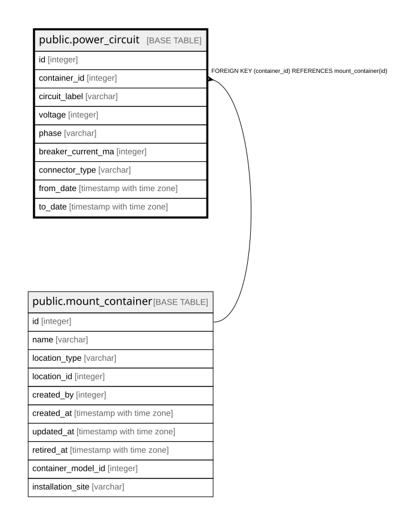

# public.power_circuit

## Description

設備・什器が受ける給電の回路 — 履歴テーブル（12.7、12.10、#206）。A系・B系のように1つの設備・什器に複数来る。変更は閉じて開く

## Columns

| Name | Type | Default | Nullable | Children | Parents | Comment |
| ---- | ---- | ------- | -------- | -------- | ------- | ------- |
| id | integer |  | false |  |  |  |
| container_id | integer |  | false |  | [public.mount_container](public.mount_container.md) |  |
| circuit_label | varchar |  | false |  |  | 系統名。同じ設備・什器の現在の行の中で一意 |
| voltage | integer |  | false |  |  |  |
| phase | varchar |  | false |  |  | Single / Three。三相の計算はv2 |
| breaker_current_ma | integer |  | false |  |  | ブレーカー定格（mA）。連続負荷の目安（80%）は保存しない |
| connector_type | varchar |  | true |  |  | コンセントの形状（開いた語彙） |
| from_date | timestamp with time zone |  | false |  |  |  |
| to_date | timestamp with time zone |  | true |  |  |  |

## Constraints

| Name | Type | Definition |
| ---- | ---- | ---------- |
| power_circuit_breaker_current_ma_not_null | n | NOT NULL breaker_current_ma |
| power_circuit_circuit_label_not_null | n | NOT NULL circuit_label |
| power_circuit_container_id_not_null | n | NOT NULL container_id |
| power_circuit_from_date_not_null | n | NOT NULL from_date |
| power_circuit_id_not_null | n | NOT NULL id |
| power_circuit_phase_not_null | n | NOT NULL phase |
| power_circuit_voltage_not_null | n | NOT NULL voltage |
| power_circuit_container_id_fkey | FOREIGN KEY | FOREIGN KEY (container_id) REFERENCES mount_container(id) |
| power_circuit_pkey | PRIMARY KEY | PRIMARY KEY (id) |

## Indexes

| Name | Definition |
| ---- | ---------- |
| power_circuit_pkey | CREATE UNIQUE INDEX power_circuit_pkey ON public.power_circuit USING btree (id) |
| idx_power_circuit_container_id | CREATE INDEX idx_power_circuit_container_id ON public.power_circuit USING btree (container_id) |

## Relations

---

> Generated by [tbls](https://github.com/k1LoW/tbls)
