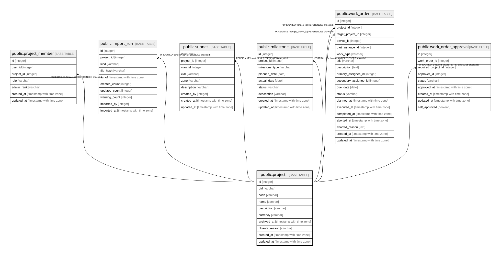

# public.project

## Description

プロジェクト。**サービスの開始日・終了日と進行状態を持たない**（5.1）。  
それらは MILESTONE から導出する。ここに日付を持つと「予定と実績の差」が失われる。  

## Columns

| Name | Type | Default | Nullable | Children | Parents | Comment |
| ---- | ---- | ------- | -------- | -------- | ------- | ------- |
| id | integer |  | false | [public.project_member](public.project_member.md) [public.import_run](public.import_run.md) [public.subnet](public.subnet.md) [public.milestone](public.milestone.md) [public.work_order](public.work_order.md) [public.work_order_approval](public.work_order_approval.md) |  |  |
| uid | varchar |  | false |  |  | Diorygaが採番する不変の識別子。名前を変更しても参照が切れない（5.3） |
| code | varchar |  | true |  |  | 組織のプロジェクトコード。**未設定は空文字ではなくNULL**（UNIQUEのため、空文字だと2件目が作れない） |
| name | varchar |  | false |  |  |  |
| description | varchar | ''::character varying | false |  |  |  |
| currency | varchar | 'JPY'::character varying | false |  |  | 集計通貨。**金額の小数点以下の桁数がこの値から決まる**（24.2.1） |
| archived_at | timestamp with time zone |  | true |  |  | サービス上の終了ではなく、**一覧から外すという運用判断**（5.2） |
| closure_reason | varchar |  | true |  |  | Completed / Cancelled。中止と完了を区別しないと納期遵守率の集計が汚れる（10.4） |
| created_at | timestamp with time zone |  | false |  |  |  |
| updated_at | timestamp with time zone |  | false |  |  |  |

## Constraints

| Name | Type | Definition |
| ---- | ---- | ---------- |
| project_pkey | PRIMARY KEY | PRIMARY KEY (id) |
| project_uid_key | UNIQUE | UNIQUE (uid) |
| project_code_key | UNIQUE | UNIQUE (code) |

## Indexes

| Name | Definition |
| ---- | ---------- |
| project_pkey | CREATE UNIQUE INDEX project_pkey ON public.project USING btree (id) |
| project_uid_key | CREATE UNIQUE INDEX project_uid_key ON public.project USING btree (uid) |
| project_code_key | CREATE UNIQUE INDEX project_code_key ON public.project USING btree (code) |

## Relations

---

> Generated by [tbls](https://github.com/k1LoW/tbls)
