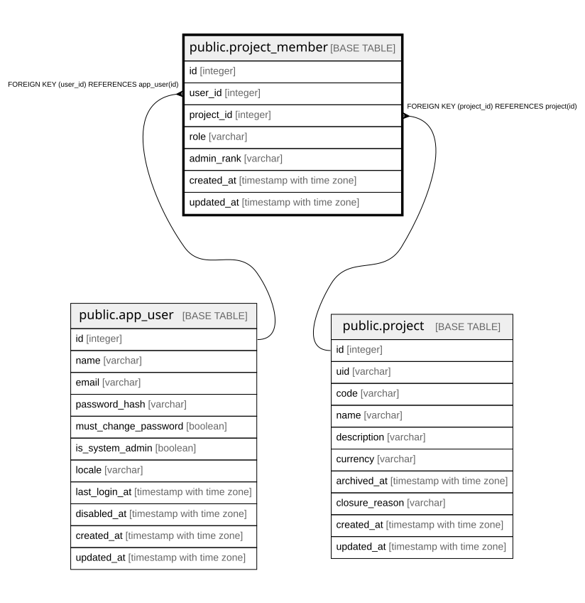

# public.project_member

## Description

利用者とプロジェクトの対応。粒度は `(user_id, project_id, role)`。  
**同一利用者が同一プロジェクトで複数ロールを兼務できる**（5章）。  

## Columns

| Name | Type | Default | Nullable | Children | Parents | Comment |
| ---- | ---- | ------- | -------- | -------- | ------- | ------- |
| id | integer |  | false |  |  |  |
| user_id | integer |  | false |  | [public.app_user](public.app_user.md) |  |
| project_id | integer |  | false |  | [public.project](public.project.md) |  |
| role | varchar |  | false |  |  |  |
| admin_rank | varchar |  | true |  |  | Primary / Secondary。role=Administrator のときのみ意味を持つ。1プロジェクトにつき各1名まで |
| created_at | timestamp with time zone |  | false |  |  |  |
| updated_at | timestamp with time zone |  | false |  |  |  |

## Constraints

| Name | Type | Definition |
| ---- | ---- | ---------- |
| project_member_created_at_not_null | n | NOT NULL created_at |
| project_member_id_not_null | n | NOT NULL id |
| project_member_project_id_not_null | n | NOT NULL project_id |
| project_member_role_not_null | n | NOT NULL role |
| project_member_updated_at_not_null | n | NOT NULL updated_at |
| project_member_user_id_not_null | n | NOT NULL user_id |
| project_member_user_id_fkey | FOREIGN KEY | FOREIGN KEY (user_id) REFERENCES app_user(id) |
| project_member_project_id_fkey | FOREIGN KEY | FOREIGN KEY (project_id) REFERENCES project(id) |
| project_member_pkey | PRIMARY KEY | PRIMARY KEY (id) |

## Indexes

| Name | Definition |
| ---- | ---------- |
| project_member_pkey | CREATE UNIQUE INDEX project_member_pkey ON public.project_member USING btree (id) |
| uq_project_member_user_project_role | CREATE UNIQUE INDEX uq_project_member_user_project_role ON public.project_member USING btree (user_id, project_id, role) |

## Relations

---

> Generated by [tbls](https://github.com/k1LoW/tbls)
