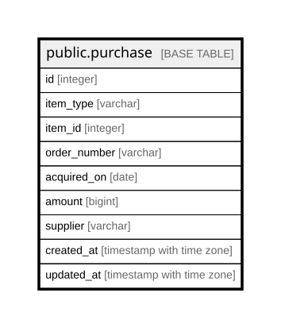

# public.purchase

## Description

購入の記録（10章）。**品目ごとに1行。発注を表すテーブルは持たない**——  
発注番号は重複してよく、注文単位の合計は order_number で寄せて求める。  
数量と通貨も持たない（数えるのは実体、金額は PROJECT.currency）。  

## Columns

| Name | Type | Default | Nullable | Children | Parents | Comment |
| ---- | ---- | ------- | -------- | -------- | ------- | ------- |
| id | integer |  | false |  |  |  |
| item_type | varchar |  | false |  |  | Device / PartInstance / SoftwareInstance。**多態的参照のため外部キーを持てない** |
| item_id | integer |  | false |  |  |  |
| order_number | varchar |  | true |  |  | **自由入力で、重複してよい。**一意の索引を張らない |
| acquired_on | date |  | true |  |  | 現品を受け取った日。**償却の開始日はこちら**（発注日は持たない） |
| amount | bigint | 0 | false |  |  | その品目1つの金額。**最小通貨単位の整数**（24.2.1）。DECIMALにしない  |
| supplier | varchar |  | true |  |  | 買った相手。**VENDOR を参照しない**——代理店・商社から買うのが普通で、カタログのベンダーに販売店が混ざる |
| created_at | timestamp with time zone |  | false |  |  |  |
| updated_at | timestamp with time zone |  | false |  |  |  |

## Constraints

| Name | Type | Definition |
| ---- | ---- | ---------- |
| purchase_amount_not_null | n | NOT NULL amount |
| purchase_created_at_not_null | n | NOT NULL created_at |
| purchase_id_not_null | n | NOT NULL id |
| purchase_item_id_not_null | n | NOT NULL item_id |
| purchase_item_type_not_null | n | NOT NULL item_type |
| purchase_updated_at_not_null | n | NOT NULL updated_at |
| purchase_pkey | PRIMARY KEY | PRIMARY KEY (id) |

## Indexes

| Name | Definition |
| ---- | ---------- |
| purchase_pkey | CREATE UNIQUE INDEX purchase_pkey ON public.purchase USING btree (id) |
| idx_purchase_target | CREATE INDEX idx_purchase_target ON public.purchase USING btree (item_type, item_id) |
| idx_purchase_order_number | CREATE INDEX idx_purchase_order_number ON public.purchase USING btree (order_number) |

## Relations

---

> Generated by [tbls](https://github.com/k1LoW/tbls)
