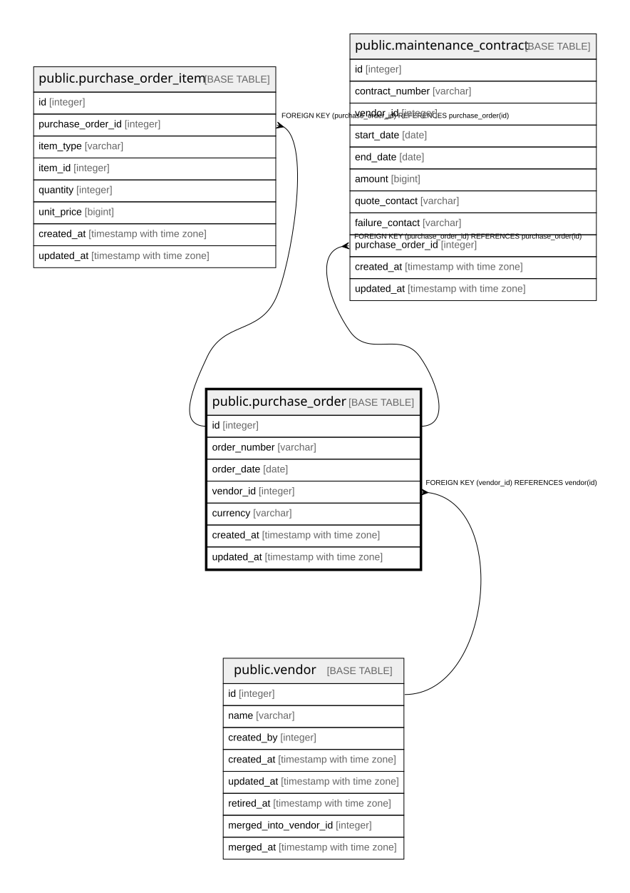

# public.purchase_order

## Description

発注（10章）。**`amount` を持たない**——明細の合計から計算する（旧B-5）。  
持つと明細と合計がずれ、どちらが正か分からなくなる。  

## Columns

| Name | Type | Default | Nullable | Children | Parents | Comment |
| ---- | ---- | ------- | -------- | -------- | ------- | ------- |
| id | integer |  | false | [public.purchase_order_item](public.purchase_order_item.md) [public.maintenance_contract](public.maintenance_contract.md) |  |  |
| order_number | varchar |  | false |  |  |  |
| order_date | date |  | false |  |  |  |
| vendor_id | integer |  | false |  | [public.vendor](public.vendor.md) |  |
| currency | varchar |  | false |  |  |  |
| created_at | timestamp with time zone |  | false |  |  |  |
| updated_at | timestamp with time zone |  | false |  |  |  |

## Constraints

| Name | Type | Definition |
| ---- | ---- | ---------- |
| purchase_order_vendor_id_fkey | FOREIGN KEY | FOREIGN KEY (vendor_id) REFERENCES vendor(id) |
| purchase_order_pkey | PRIMARY KEY | PRIMARY KEY (id) |

## Indexes

| Name | Definition |
| ---- | ---------- |
| purchase_order_pkey | CREATE UNIQUE INDEX purchase_order_pkey ON public.purchase_order USING btree (id) |
| idx_purchase_order_vendor | CREATE INDEX idx_purchase_order_vendor ON public.purchase_order USING btree (vendor_id) |
| idx_purchase_order_number | CREATE INDEX idx_purchase_order_number ON public.purchase_order USING btree (order_number) |

## Relations

---

> Generated by [tbls](https://github.com/k1LoW/tbls)
