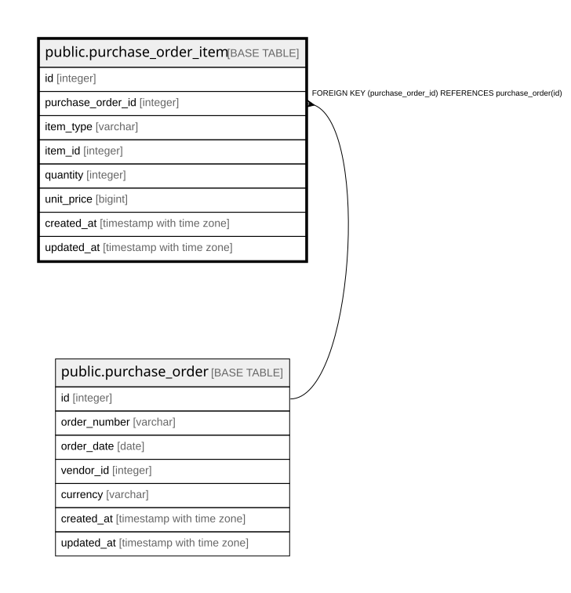

# public.purchase_order_item

## Description

発注明細（10章）。

## Columns

| Name | Type | Default | Nullable | Children | Parents | Comment |
| ---- | ---- | ------- | -------- | -------- | ------- | ------- |
| id | integer |  | false |  |  |  |
| purchase_order_id | integer |  | false |  | [public.purchase_order](public.purchase_order.md) |  |
| item_type | varchar |  | false |  |  | Device / PartInstance / SoftwareInstance。**多態的参照のため外部キーを持てない** |
| item_id | integer |  | false |  |  |  |
| quantity | integer | 1 | false |  |  |  |
| unit_price | bigint | 0 | false |  |  | **最小通貨単位の整数**（24.2.1）。DECIMALにしない  |
| created_at | timestamp with time zone |  | false |  |  |  |
| updated_at | timestamp with time zone |  | false |  |  |  |

## Constraints

| Name | Type | Definition |
| ---- | ---- | ---------- |
| purchase_order_item_purchase_order_id_fkey | FOREIGN KEY | FOREIGN KEY (purchase_order_id) REFERENCES purchase_order(id) |
| purchase_order_item_pkey | PRIMARY KEY | PRIMARY KEY (id) |

## Indexes

| Name | Definition |
| ---- | ---------- |
| purchase_order_item_pkey | CREATE UNIQUE INDEX purchase_order_item_pkey ON public.purchase_order_item USING btree (id) |
| idx_purchase_order_item_order | CREATE INDEX idx_purchase_order_item_order ON public.purchase_order_item USING btree (purchase_order_id) |
| idx_purchase_order_item_target | CREATE INDEX idx_purchase_order_item_target ON public.purchase_order_item USING btree (item_type, item_id) |

## Relations

---

> Generated by [tbls](https://github.com/k1LoW/tbls)
