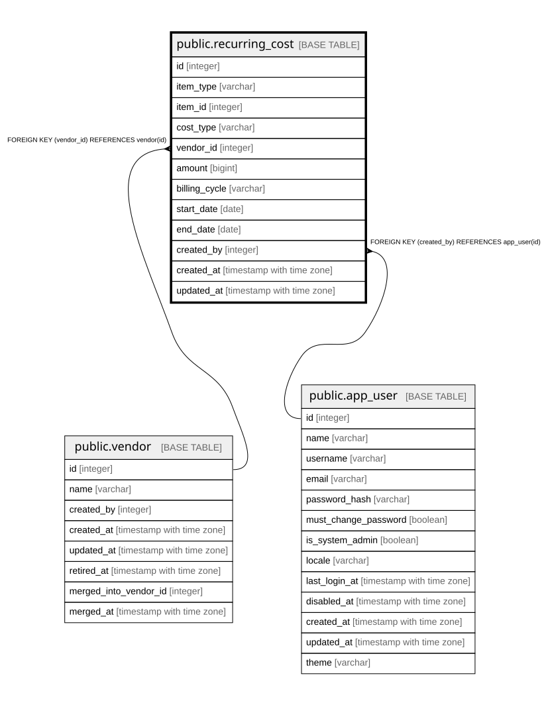

# public.recurring_cost

## Description

定期費用（10章）。ラック料金・回線費用など。

## Columns

| Name | Type | Default | Nullable | Children | Parents | Comment |
| ---- | ---- | ------- | -------- | -------- | ------- | ------- |
| id | integer |  | false |  |  |  |
| item_type | varchar |  | false |  |  | MountContainer / Project |
| item_id | integer |  | false |  |  |  |
| cost_type | varchar |  | false |  |  |  |
| vendor_id | integer |  | true |  | [public.vendor](public.vendor.md) |  |
| amount | bigint | 0 | false |  |  | **最小通貨単位の整数**（24.2.1） |
| billing_cycle | varchar |  | false |  |  | Monthly / Annual |
| start_date | date |  | false |  |  |  |
| end_date | date |  | true |  |  | null = 継続中 |
| created_by | integer |  | false |  | [public.app_user](public.app_user.md) |  |
| created_at | timestamp with time zone |  | false |  |  |  |
| updated_at | timestamp with time zone |  | false |  |  |  |

## Constraints

| Name | Type | Definition |
| ---- | ---- | ---------- |
| recurring_cost_amount_not_null | n | NOT NULL amount |
| recurring_cost_billing_cycle_not_null | n | NOT NULL billing_cycle |
| recurring_cost_cost_type_not_null | n | NOT NULL cost_type |
| recurring_cost_created_at_not_null | n | NOT NULL created_at |
| recurring_cost_created_by_not_null | n | NOT NULL created_by |
| recurring_cost_id_not_null | n | NOT NULL id |
| recurring_cost_item_id_not_null | n | NOT NULL item_id |
| recurring_cost_item_type_not_null | n | NOT NULL item_type |
| recurring_cost_start_date_not_null | n | NOT NULL start_date |
| recurring_cost_updated_at_not_null | n | NOT NULL updated_at |
| recurring_cost_created_by_fkey | FOREIGN KEY | FOREIGN KEY (created_by) REFERENCES app_user(id) |
| recurring_cost_vendor_id_fkey | FOREIGN KEY | FOREIGN KEY (vendor_id) REFERENCES vendor(id) |
| recurring_cost_pkey | PRIMARY KEY | PRIMARY KEY (id) |

## Indexes

| Name | Definition |
| ---- | ---------- |
| recurring_cost_pkey | CREATE UNIQUE INDEX recurring_cost_pkey ON public.recurring_cost USING btree (id) |
| idx_recurring_cost_target | CREATE INDEX idx_recurring_cost_target ON public.recurring_cost USING btree (item_type, item_id) |
| idx_recurring_cost_vendor | CREATE INDEX idx_recurring_cost_vendor ON public.recurring_cost USING btree (vendor_id) |
| idx_recurring_cost_created_by | CREATE INDEX idx_recurring_cost_created_by ON public.recurring_cost USING btree (created_by) |

## Relations

---

> Generated by [tbls](https://github.com/k1LoW/tbls)
