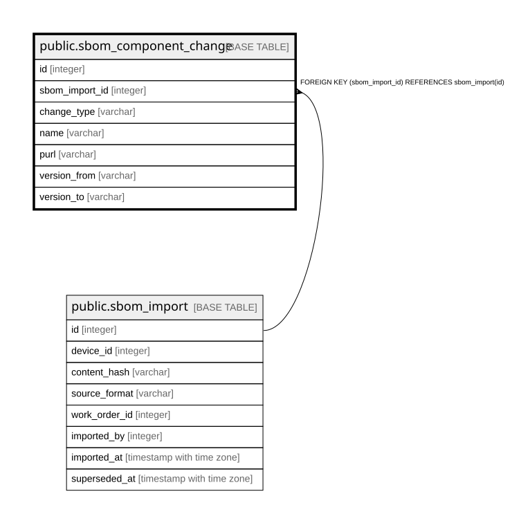

# public.sbom_component_change

## Description

直前の取込との差分（9.5）。**SBOM取込の目的はこれを記録すること**であり、  
コンポーネント1件ごとの集計は要件ではない（9.2）。構成に変化がなければ0件。  

## Columns

| Name | Type | Default | Nullable | Children | Parents | Comment |
| ---- | ---- | ------- | -------- | -------- | ------- | ------- |
| id | integer |  | false |  |  |  |
| sbom_import_id | integer |  | false |  | [public.sbom_import](public.sbom_import.md) |  |
| change_type | varchar |  | false |  |  |  |
| name | varchar |  | false |  |  |  |
| purl | varchar |  | true |  |  | 差分計算時の同一性判定キー。**無いコンポーネントは `name` で代替する**（9.6） |
| version_from | varchar |  | true |  |  |  |
| version_to | varchar |  | true |  |  |  |

## Constraints

| Name | Type | Definition |
| ---- | ---- | ---------- |
| sbom_component_change_change_type_not_null | n | NOT NULL change_type |
| sbom_component_change_id_not_null | n | NOT NULL id |
| sbom_component_change_name_not_null | n | NOT NULL name |
| sbom_component_change_sbom_import_id_not_null | n | NOT NULL sbom_import_id |
| sbom_component_change_sbom_import_id_fkey | FOREIGN KEY | FOREIGN KEY (sbom_import_id) REFERENCES sbom_import(id) |
| sbom_component_change_pkey | PRIMARY KEY | PRIMARY KEY (id) |

## Indexes

| Name | Definition |
| ---- | ---------- |
| sbom_component_change_pkey | CREATE UNIQUE INDEX sbom_component_change_pkey ON public.sbom_component_change USING btree (id) |
| idx_sbom_component_change_import | CREATE INDEX idx_sbom_component_change_import ON public.sbom_component_change USING btree (sbom_import_id) |

## Relations

---

> Generated by [tbls](https://github.com/k1LoW/tbls)
