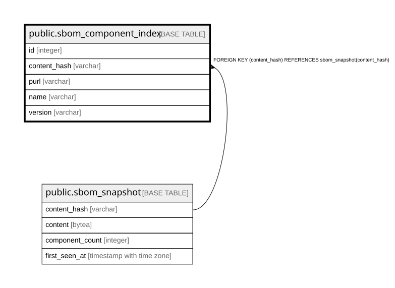

# public.sbom_component_index

## Description

機器横断のコンポーネント検索用の索引（9.8）。**再構築可能な派生索引であり、真実の源は SBOM_SNAPSHOT。**  
**`content_hash` 単位に張る（Device単位にしない）。**Device単位だと3,000万行になる。  

## Columns

| Name | Type | Default | Nullable | Children | Parents | Comment |
| ---- | ---- | ------- | -------- | -------- | ------- | ------- |
| id | integer |  | false |  |  |  |
| content_hash | varchar |  | false |  | [public.sbom_snapshot](public.sbom_snapshot.md) |  |
| purl | varchar |  | true |  |  |  |
| name | varchar |  | false |  |  |  |
| version | varchar |  | false |  |  |  |

## Constraints

| Name | Type | Definition |
| ---- | ---- | ---------- |
| sbom_component_index_content_hash_fkey | FOREIGN KEY | FOREIGN KEY (content_hash) REFERENCES sbom_snapshot(content_hash) |
| sbom_component_index_pkey | PRIMARY KEY | PRIMARY KEY (id) |

## Indexes

| Name | Definition |
| ---- | ---------- |
| sbom_component_index_pkey | CREATE UNIQUE INDEX sbom_component_index_pkey ON public.sbom_component_index USING btree (id) |
| idx_sbom_component_index_content_hash | CREATE INDEX idx_sbom_component_index_content_hash ON public.sbom_component_index USING btree (content_hash) |
| idx_sbom_component_index_purl | CREATE INDEX idx_sbom_component_index_purl ON public.sbom_component_index USING btree (purl) |
| idx_sbom_component_index_name | CREATE INDEX idx_sbom_component_index_name ON public.sbom_component_index USING btree (name) |

## Relations

---

> Generated by [tbls](https://github.com/k1LoW/tbls)
