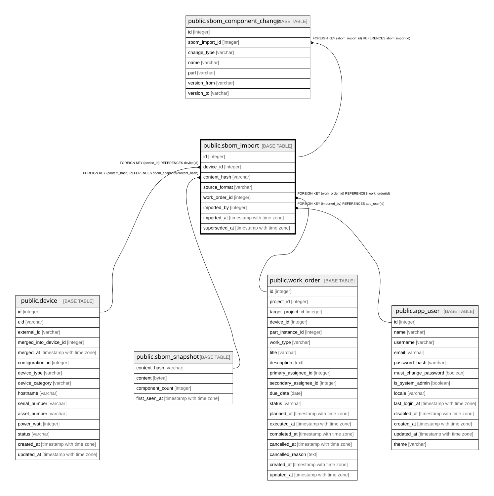

# public.sbom_import

## Description

SBOMの取込記録（9.5）。**`superseded_at` は他の履歴テーブルの `to_date` と同じ役割**を果たす。  
**取込は SOFTWARE_INSTANCE も VENDOR も自動生成しない**（9.6。資産管理の判断は人が行う）。  

## Columns

| Name | Type | Default | Nullable | Children | Parents | Comment |
| ---- | ---- | ------- | -------- | -------- | ------- | ------- |
| id | integer |  | false | [public.sbom_component_change](public.sbom_component_change.md) |  |  |
| device_id | integer |  | false |  | [public.device](public.device.md) |  |
| content_hash | varchar |  | false |  | [public.sbom_snapshot](public.sbom_snapshot.md) |  |
| source_format | varchar |  | false |  |  |  |
| work_order_id | integer |  | true |  | [public.work_order](public.work_order.md) |  |
| imported_by | integer |  | false |  | [public.app_user](public.app_user.md) |  |
| imported_at | timestamp with time zone |  | false |  |  |  |
| superseded_at | timestamp with time zone |  | true |  |  | null = そのDeviceの最新の観測結果 |

## Constraints

| Name | Type | Definition |
| ---- | ---- | ---------- |
| sbom_import_content_hash_not_null | n | NOT NULL content_hash |
| sbom_import_device_id_not_null | n | NOT NULL device_id |
| sbom_import_id_not_null | n | NOT NULL id |
| sbom_import_imported_at_not_null | n | NOT NULL imported_at |
| sbom_import_imported_by_not_null | n | NOT NULL imported_by |
| sbom_import_source_format_not_null | n | NOT NULL source_format |
| sbom_import_imported_by_fkey | FOREIGN KEY | FOREIGN KEY (imported_by) REFERENCES app_user(id) |
| sbom_import_device_id_fkey | FOREIGN KEY | FOREIGN KEY (device_id) REFERENCES device(id) |
| sbom_import_work_order_id_fkey | FOREIGN KEY | FOREIGN KEY (work_order_id) REFERENCES work_order(id) |
| sbom_import_content_hash_fkey | FOREIGN KEY | FOREIGN KEY (content_hash) REFERENCES sbom_snapshot(content_hash) |
| sbom_import_pkey | PRIMARY KEY | PRIMARY KEY (id) |

## Indexes

| Name | Definition |
| ---- | ---------- |
| sbom_import_pkey | CREATE UNIQUE INDEX sbom_import_pkey ON public.sbom_import USING btree (id) |
| idx_sbom_import_device | CREATE INDEX idx_sbom_import_device ON public.sbom_import USING btree (device_id) |
| idx_sbom_import_content_hash | CREATE INDEX idx_sbom_import_content_hash ON public.sbom_import USING btree (content_hash) |
| idx_sbom_import_work_order | CREATE INDEX idx_sbom_import_work_order ON public.sbom_import USING btree (work_order_id) |
| idx_sbom_import_imported_by | CREATE INDEX idx_sbom_import_imported_by ON public.sbom_import USING btree (imported_by) |
| uq_sbom_import_current | CREATE UNIQUE INDEX uq_sbom_import_current ON public.sbom_import USING btree (device_id) WHERE (superseded_at IS NULL) |

## Relations

---

> Generated by [tbls](https://github.com/k1LoW/tbls)
