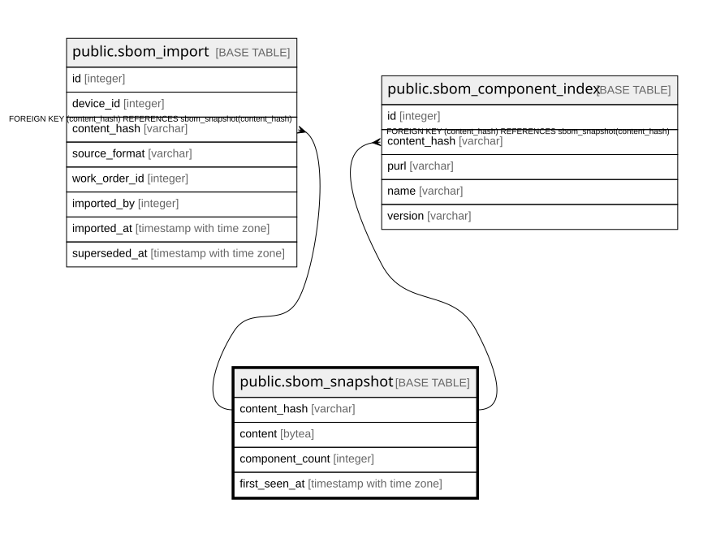

# public.sbom_snapshot

## Description

SBOMのスナップショット（9.7）。**本システムで唯一、代理キーを持たないテーブル。**  
主キーは正規化後の内容のSHA-256で、**同一内容は1件しか保存しない。**  
ゴールデンイメージが同じ機器が何台あっても実体は1つであり、保存量が台数に比例しない。  

## Columns

| Name | Type | Default | Nullable | Children | Parents | Comment |
| ---- | ---- | ------- | -------- | -------- | ------- | ------- |
| content_hash | varchar |  | false | [public.sbom_import](public.sbom_import.md) [public.sbom_component_index](public.sbom_component_index.md) |  |  |
| content | bytea |  | false |  |  | zstdで圧縮した正規化済みコンポーネント一覧。**内側の形式はJSONのまま**（デバッグ容易性を優先） |
| component_count | integer |  | false |  |  |  |
| first_seen_at | timestamp with time zone |  | false |  |  |  |

## Constraints

| Name | Type | Definition |
| ---- | ---- | ---------- |
| sbom_snapshot_component_count_not_null | n | NOT NULL component_count |
| sbom_snapshot_content_hash_not_null | n | NOT NULL content_hash |
| sbom_snapshot_content_not_null | n | NOT NULL content |
| sbom_snapshot_first_seen_at_not_null | n | NOT NULL first_seen_at |
| sbom_snapshot_pkey | PRIMARY KEY | PRIMARY KEY (content_hash) |

## Indexes

| Name | Definition |
| ---- | ---------- |
| sbom_snapshot_pkey | CREATE UNIQUE INDEX sbom_snapshot_pkey ON public.sbom_snapshot USING btree (content_hash) |

## Relations

---

> Generated by [tbls](https://github.com/k1LoW/tbls)
