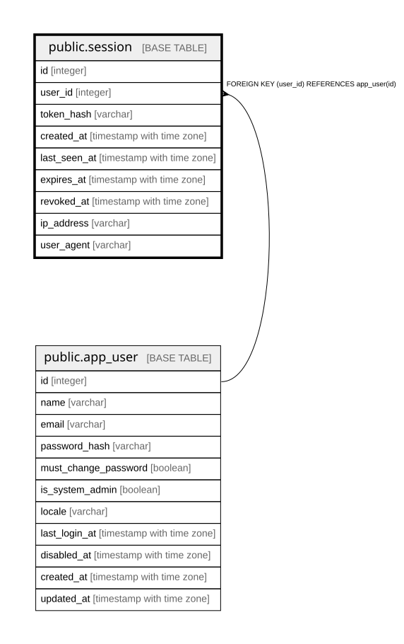

# public.session

## Description

セッション。生のトークンは保存せずハッシュのみを持つ（20.5）。

## Columns

| Name | Type | Default | Nullable | Children | Parents | Comment |
| ---- | ---- | ------- | -------- | -------- | ------- | ------- |
| id | integer |  | false |  |  |  |
| user_id | integer |  | false |  | [public.app_user](public.app_user.md) |  |
| token_hash | varchar |  | false |  |  |  |
| created_at | timestamp with time zone |  | false |  |  |  |
| last_seen_at | timestamp with time zone |  | false |  |  |  |
| expires_at | timestamp with time zone |  | false |  |  |  |
| revoked_at | timestamp with time zone |  | true |  |  |  |
| ip_address | varchar | ''::character varying | false |  |  |  |
| user_agent | varchar | ''::character varying | false |  |  |  |

## Constraints

| Name | Type | Definition |
| ---- | ---- | ---------- |
| session_created_at_not_null | n | NOT NULL created_at |
| session_expires_at_not_null | n | NOT NULL expires_at |
| session_id_not_null | n | NOT NULL id |
| session_ip_address_not_null | n | NOT NULL ip_address |
| session_last_seen_at_not_null | n | NOT NULL last_seen_at |
| session_token_hash_not_null | n | NOT NULL token_hash |
| session_user_agent_not_null | n | NOT NULL user_agent |
| session_user_id_not_null | n | NOT NULL user_id |
| session_user_id_fkey | FOREIGN KEY | FOREIGN KEY (user_id) REFERENCES app_user(id) |
| session_pkey | PRIMARY KEY | PRIMARY KEY (id) |
| session_token_hash_key | UNIQUE | UNIQUE (token_hash) |

## Indexes

| Name | Definition |
| ---- | ---------- |
| session_pkey | CREATE UNIQUE INDEX session_pkey ON public.session USING btree (id) |
| session_token_hash_key | CREATE UNIQUE INDEX session_token_hash_key ON public.session USING btree (token_hash) |
| idx_session_user_id | CREATE INDEX idx_session_user_id ON public.session USING btree (user_id) |

## Relations

---

> Generated by [tbls](https://github.com/k1LoW/tbls)
