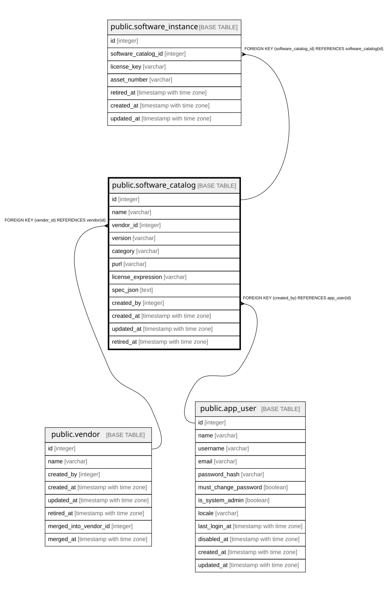

# public.software_catalog

## Description

ソフトウェアのカタログ。**SBOM取込はこのテーブルを自動生成しない**（9.2）。  
人が資産として登録したものだけを置く。  

## Columns

| Name | Type | Default | Nullable | Children | Parents | Comment |
| ---- | ---- | ------- | -------- | -------- | ------- | ------- |
| id | integer |  | false | [public.software_instance](public.software_instance.md) |  |  |
| name | varchar |  | false |  |  |  |
| vendor_id | integer |  | true |  | [public.vendor](public.vendor.md) |  |
| version | varchar |  | false |  |  |  |
| category | varchar |  | false |  |  |  |
| purl | varchar |  | true |  |  | あればこれが一意。**NULL同士は重複と見なされない**ため、持たない行は何件でも共存する |
| license_expression | varchar | ''::character varying | false |  |  |  |
| spec_json | text | '{}'::text | false |  |  |  |
| created_by | integer |  | false |  | [public.app_user](public.app_user.md) |  |
| created_at | timestamp with time zone |  | false |  |  |  |
| updated_at | timestamp with time zone |  | false |  |  |  |
| retired_at | timestamp with time zone |  | true |  |  |  |

## Constraints

| Name | Type | Definition |
| ---- | ---- | ---------- |
| software_catalog_created_by_fkey | FOREIGN KEY | FOREIGN KEY (created_by) REFERENCES app_user(id) |
| software_catalog_vendor_id_fkey | FOREIGN KEY | FOREIGN KEY (vendor_id) REFERENCES vendor(id) |
| software_catalog_pkey | PRIMARY KEY | PRIMARY KEY (id) |

## Indexes

| Name | Definition |
| ---- | ---------- |
| software_catalog_pkey | CREATE UNIQUE INDEX software_catalog_pkey ON public.software_catalog USING btree (id) |
| uq_software_catalog_purl | CREATE UNIQUE INDEX uq_software_catalog_purl ON public.software_catalog USING btree (purl) |
| uq_software_catalog_name_vendor_version | CREATE UNIQUE INDEX uq_software_catalog_name_vendor_version ON public.software_catalog USING btree (name, vendor_id, version) |
| idx_software_catalog_retired_at | CREATE INDEX idx_software_catalog_retired_at ON public.software_catalog USING btree (retired_at) |

## Relations

---

> Generated by [tbls](https://github.com/k1LoW/tbls)
